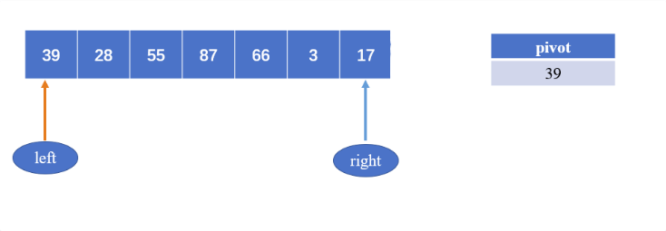
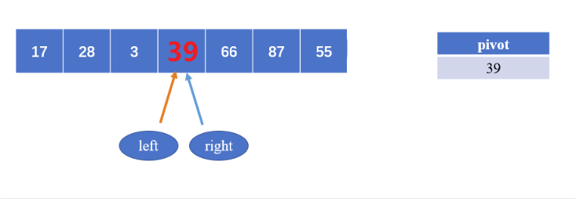

# 前置知识

## 快速排序

快速排序使用 **分治（Divide and Conquer）策略** 来把一个序列（list）分为较小和较大的 2 个子序列，然后递归地排序两个子序列。

时间复杂度：

- 平均：`O(n logn)`
- 最好：`O(n logn)`
- 最坏：`O(n^2)`

空间复杂度：

- `O(logn)`

稳定性：不稳定

---

定义快速排序算法 `quick_sort()`，其包含以下步骤：

- **挑选基准值 `pivot`**：从数列中挑出一个元素，称为 基准（pivot）。使用双指针 left 和 right，初始值分别指向数组的首元素和尾元素，pivot一般初始化为指向数组首元素或尾元素。假设指向首元素。
- **分割——分区 `partition()` 操作**：重新排序数列，所有比基准值 pivot 小的元素摆放在基准前面，所有比基准值 pivot 大的元素摆在基准后面（与基准值相等的数可以到任何一边）。在这个分割结束之后，对基准值的排序就已经完成，该基准就处于数列的中间位置。上述过程称为分区操作。具体地，
  - right 指针从后往前找比pivot元素小的数，如果当前循环没找到，就执行 right--；如果找到了，则将该值赋给left指向的位置；
  - left 指针从前往后找比pivot元素大的数，如果当前循环没找到，就执行 left ++；如果找到了，则将该值赋给right指向的位置；
  - 当 left == right 时，使用 pivot 指向的元素对该位置进行赋值；
  - 数组被分为三部分：x[left, pivot-1]，x[pivot]，x[pivot+1, right]
- **递归调用 `quick_sort()` 以排序子序列**：递归地将小于基准值元素的子序列和大于基准值元素的子序列排序，即两个区间 `x[left, pivot-1]` 和 `x[pivot+1, right]`。

选取基准值有多种具体方法，此选取方法对排序的时间性能有决定性影响。一轮遍历结果：





第一种解法：

```python
from typing import List


def partition(arr: List, left: int, right: int):
    # 选取首元素
    pivot = arr[left]
    while left < right:
        while left < right and arr[right] >= pivot:
            right -= 1
        arr[left] = arr[right]
        
        while left < right and arr[left] <= pivot:
            left += 1
        arr[right] = arr[left]
    # 退出循环时，left=right，所以都可以
    arr[left] == pivot
    return left


def quick_sort(arr: List, left, right):
    if left < right:
        pivot = partition(arr, left, right)
        quick_sort(arr, left, pivot-1)
        quick_sort(arr, pivot+1, right)
```

第二种解法：

```python
def partition(arr, left, right):
    """子序列划分"""
    # 选取尾元素
    pivot = arr[right]
    
    i = left - 1  # 记录元素均不大于pivot的子序列中最右侧元素的索引上界
    
    for j in range(left, right):
        if arr[j] <= pivot:
            i += 1  # 元素均不大于pivot的子序列，元素索引上界右移
            arr[i], arr[j] = arr[j], arr[i]
            
    arr[i + 1], arr[r] = arr[r], arr[i + 1]
    
    return i + 1


def inplace_quick_sort(arr, left, right):
    """针对列表的原地快速排序实现"""
    
    if left < right:
        pivot = partition(arr, left, right)
        inplace_quick_sort(arr, left, pivot - 1)
        inplace_quick_sort(arr, pivot + 1, right)


arr = [23, 13, 45, 16, 32, 56, 98, 11]
inplace_quick_sort(arr, 0, len(arr) - 1)
print(arr)  # [11, 13, 16, 23, 32, 45, 56, 98]
```

> 参考：
>
> 1. [link1](ttps://github.com/datamonday/Algorithm-Engineer-Technical-Stack/blob/main/01%20Algorithm%20Code/02%20%E5%B8%B8%E7%94%A8%E6%8E%92%E5%BA%8F%E7%AE%97%E6%B3%95.ipynb)
> 2. [link2](https://cloud.tencent.com/developer/article/1819946)
> 3. [link3](https://cloud.tencent.com/developer/article/1613752?from=article.detail.1819946)
> 4. [link4](https://www.runoob.com/python3/python-quicksort.html)

## 归并排序

归并排序（Merge Sort）是创建在归并操作上的一种有效的排序算法。该算法是采用分治法（Divide and Conquer）的一个非常典型的应用。

分治法:

- 分割：递归地把当前序列平均分割成两半。
- 集成：在保持元素顺序的同时将上一步得到的子序列集成到一起（归并）。

时间复杂度：

- 平均：`O(n logn)`
- 最好：`O(n logn)`
- 最坏：`O(n logn)`

空间复杂度：

- `O(n)`

稳定性：稳定

归并排序可以用于内部排序，也可以使用于排不排序。在外部排序时，通常采用多路归并，并且通过解决长顺串的合并，缠上长的初始串，提高主机与外设并行能力等，以减少访问外存额外次数，提高外排的效率。

当数据规模较大时，应用速度最快的排序算法，可以考虑使用快速排序。当记录随机分布的时候，快速排序平均时间最短，但是出现最坏的情况，这个时候的时间复杂度是O(n^2)，且递归深度为n，所需的占空间为O(n)。

------

### 算法步骤

1. 申请空间，使其大小为两个已经排序序列之和，该空间用来存放合并后的序列；
2. 设定两个指针，最初位置分别为两个已经排序序列的起始位置；
3. 比较两个指针所指向的元素，选择相对小的元素放入到合并空间，并移动指针到下一位置；
4. 重复步骤 3 直到某一指针达到序列尾；
5. 将另一序列剩下的所有元素直接复制到合并序列尾。


```python
def merge_sort(arry):
    if len(arry) <= 1:
        return arry
    
    length = len(array)
    middle = length // 2

    left  = merge_sort(arry[:middle])  # 左边
    right = merge_sort(arry[middle:])  # 右边
    merged = []
    
    while left and right:
        if left [0] <= right[0]:
        	merged.append(left.pop(0))
        else:
            merged.append(right.pop(0))
    
    if right:
    	merged.extend(right)
    else:
        merged.extend(left)
    
    return merged
```

> 参考：
>
> 1. [link1](https://www.runoob.com/python3/python-merge-sort.html)
> 2. [link2](https://www.cnblogs.com/chengxiao/p/6194356.html)

## 二分查找

> https://leetcode.cn/problems/binary-search/

给定一个 n 个元素有序的（升序）整型数组 nums 和一个目标值 target  ，写一个函数搜索 nums 中的 target，如果目标值存在返回下标，否则返回 -1。

```python
class Solution:
    def search(self, nums: List[int], target: int) -> int:
        """ 
        二分查找
        --------
        核心思想：维护三个指针，pivot，left，right；
        首先比较目标值与中间值，如果相等则返回；
        如果目标值小于中间值，则向左查找（通过每次循环将右指针-1实现），大于中间值时同理；
        """
        left, right = 0, len(nums) - 1
        while left <= right:
            
            pivot = left + (right - left) // 2

            if nums[pivot] == target:
                return pivot
            elif target < nums[pivot]:
                right = pivot - 1
            else:
                left = pivot + 1
        
        return -1
```

二分查找模板

```python
def binary_search(od_list, key, left, right):
    while left < right:
        mid = (left + right) // 2
        if key == od_list[mid]:
            return mid
        elif key > od_list[mid]:
            left = mid + 1
        else:
            right = mid - 1
    return None
```

# 题目列表

## 二分查找、分治

- [x] [剑指 Offer 51. 数组中的逆序对](https://leetcode.cn/problems/shu-zu-zhong-de-ni-xu-dui-lcof/)
- [x] [315. 计算右侧小于当前元素的个数](https://leetcode.cn/problems/count-of-smaller-numbers-after-self/)
- [x] [300. 最长递增子序列](https://leetcode.cn/problems/longest-increasing-subsequence/)
- [x] [378. 有序矩阵中第 K 小的元素](https://leetcode.cn/problems/kth-smallest-element-in-a-sorted-matrix/)
- [x] [4. 寻找两个正序数组的中位数](https://leetcode.cn/problems/median-of-two-sorted-arrays/)
- [x] [69. x 的平方根](https://leetcode.cn/problems/sqrtx/)
- [x] [367. 有效的完全平方数](https://leetcode.cn/problems/valid-perfect-square/)
- [x] [50. Pow(x, n)](https://leetcode.cn/problems/powx-n/)
- [x] [268. 丢失的数字](https://leetcode.cn/problems/missing-number/)
- [x] [287. 寻找重复数](https://leetcode.cn/problems/find-the-duplicate-number/)
- [x] [35. 搜索插入位置](https://leetcode.cn/problems/search-insert-position/)
- [x] [41. 缺失的第一个正数](https://leetcode.cn/problems/first-missing-positive/)

## 字符串、排序

- [x] [面试题 05.02. 二进制数转字符串](https://leetcode.cn/problems/bianry-number-to-string-lcci/)
- [x] [5. 最长回文子串](https://leetcode.cn/problems/longest-palindromic-substring/)
- [x] [93. 复原 IP 地址](https://leetcode.cn/problems/restore-ip-addresses/)
- [x] [227. 基本计算器 II](https://leetcode.cn/problems/basic-calculator-ii/)

## 链表、队列、哈希
- [x] [剑指 Offer 35. 复杂链表的复制](https://leetcode.cn/problems/fu-za-lian-biao-de-fu-zhi-lcof/)
- [x] [692. 前K个高频单词](https://leetcode.cn/problems/top-k-frequent-words/)
- [x] [1721. 交换链表中的节点](https://leetcode.cn/problems/swapping-nodes-in-a-linked-list/)

## 树、二叉树

- [x] [662. 二叉树最大宽度](https://leetcode.cn/problems/maximum-width-of-binary-tree/)
- [x] [1466. 重新规划路线](https://leetcode.cn/problems/reorder-routes-to-make-all-paths-lead-to-the-city-zero/)
- [x] [102. 二叉树的层序遍历](https://leetcode.cn/problems/binary-tree-level-order-traversal/)
- [x] [1026. 节点与其祖先之间的最大差值](https://leetcode.cn/problems/maximum-difference-between-node-and-ancestor/)

## 栈、单调栈

- [x] [394. 字符串解码](https://leetcode.cn/problems/decode-string/)
- [x] [739. 每日温度](https://leetcode.cn/problems/daily-temperatures/)
- [x] [1673. 找出最具竞争力的子序列](https://leetcode.cn/problems/find-the-most-competitive-subsequence/)
- [x] [1081. 不同字符的最小子序列](https://leetcode.cn/problems/smallest-subsequence-of-distinct-characters/)
- [x] [402. 移掉K位数字](https://leetcode.cn/problems/remove-k-digits/)
- [x] [321. 拼接最大数](https://leetcode.cn/problems/create-maximum-number/)
- [x] [456. 132 模式](https://leetcode.cn/problems/132-pattern/)
- [x] [684. 冗余连接](https://leetcode.cn/problems/redundant-connection/)
- [x] [42.接雨水](https://leetcode.cn/problems/trapping-rain-water/)

## 滑动窗口、双指针

- [x] [283. 移动零](https://leetcode.cn/problems/move-zeroes/)

- [x] [986. 区间列表的交集](https://leetcode.cn/problems/interval-list-intersections/)
- [x] [1004. 最大连续1的个数 III](https://leetcode.cn/problems/max-consecutive-ones-iii/)
- [x] [1744. 你能在你最喜欢的那天吃到你最喜欢的糖果吗？](https://leetcode.cn/problems/can-you-eat-your-favorite-candy-on-your-favorite-day/)
- [x] [11. 盛最多水的容器](https://leetcode.cn/problems/container-with-most-water/)

## 递归、回溯
- [x] [24. 两两交换链表中的节点](https://leetcode.cn/problems/swap-nodes-in-pairs/)
- [x] [144. 二叉树的前序遍历](https://leetcode.cn/problems/binary-tree-preorder-traversal/)
- [x] [236. 二叉树的最近公共祖先](https://leetcode.cn/problems/lowest-common-ancestor-of-a-binary-tree/)
- [x] [17. 电话号码的字母组合](https://leetcode.cn/problems/letter-combinations-of-a-phone-number/)
- [x] [395. 至少有 K 个重复字符的最长子串](https://leetcode.cn/problems/longest-substring-with-at-least-k-repeating-characters/)
- [x] [698. 划分为k个相等的子集](https://leetcode.cn/problems/partition-to-k-equal-sum-subsets/)
- [x] [473. 火柴拼正方形](https://leetcode.cn/problems/matchsticks-to-square/)
- [x] [395. 至少有 K 个重复字符的最长子串](https://leetcode.cn/problems/longest-substring-with-at-least-k-repeating-characters/)
- [x] [78. 子集](https://leetcode.cn/problems/subsets/)
- [x] [79. 单词搜索](https://leetcode.cn/problems/word-search/)
- [x] [401. 二进制手表](https://leetcode.cn/problems/binary-watch/)
- [x] [494. 目标和](https://leetcode.cn/problems/target-sum/)
- [x] [301. 删除无效的括号](https://leetcode.cn/problems/remove-invalid-parentheses/)
- [x] [22. 括号生成](https://leetcode.cn/problems/generate-parentheses/)
- [x] [剑指 Offer 38. 字符串的排列](https://leetcode.cn/problems/zi-fu-chuan-de-pai-lie-lcof/)
- [x] [784. 字母大小写全排列](https://leetcode.cn/problems/letter-case-permutation/)

## BFS、DFS

- [x] [114. 二叉树展开为链表](https://leetcode.cn/problems/flatten-binary-tree-to-linked-list/)
- [x] [279. 完全平方数](https://leetcode.cn/problems/perfect-squares/)
- [x] [207. 课程表](https://leetcode.cn/problems/course-schedule/)
- [x] [200. 岛屿数量](https://leetcode.cn/problems/number-of-islands/)
- [x] [463. 岛屿的周长](https://leetcode.cn/problems/island-perimeter/)
- [x] [695. 岛屿的最大面积](https://leetcode.cn/problems/max-area-of-island/)
- [x] [827. 最大人工岛](https://leetcode.cn/problems/making-a-large-island/)
- [x] [130. 被围绕的区域](https://leetcode.cn/problems/surrounded-regions/)

## 贪心、动态规划
- [x] [621. 任务调度器](https://leetcode.cn/problems/task-scheduler/)
- [ ] [881. 救生艇](https://leetcode.cn/problems/boats-to-save-people/)
- [ ] [198. 打家劫舍](https://leetcode.cn/problems/house-robber/)
- [ ] [213. 打家劫舍 II](https://leetcode.cn/problems/house-robber-ii/)
- [ ] [337. 打家劫舍 III](https://leetcode.cn/problems/house-robber-iii/)


# ----------------

# 二分查找、分治、归并

## OF-51-数组中的逆序对-归并

> https://leetcode.cn/problems/shu-zu-zhong-de-ni-xu-dui-lcof/

在数组中的两个数字，如果前面一个数字大于后面的数字，则这两个数字组成一个逆序对。输入一个数组，求出这个数组中的逆序对的总数。

> **示例 1:**
>
> ```python
> 输入: [7,5,6,4]
> 输出: 5
> ```

求解思路：

> https://leetcode.cn/problems/shu-zu-zhong-de-ni-xu-dui-lcof/solution/jian-zhi-offer-51-shu-zu-zhong-de-ni-xu-pvn2h/
>
> https://leetcode.cn/problems/shu-zu-zhong-de-ni-xu-dui-lcof/solution/shu-zu-zhong-de-ni-xu-dui-by-leetcode-solution/
>
> https://leetcode.cn/problems/shu-zu-zhong-de-ni-xu-dui-lcof/solution/jian-dan-yi-dong-gui-bing-pai-xu-python-by-azl3979/

「归并排序」与「逆序对」是息息相关的。归并排序体现了 分而治之 的算法思想，具体为：

- 分： 不断将数组从中点位置划分开（即二分法），将整个数组的排序问题转化为子数组的排序问题；
- 治： 划分到子数组长度为 1 时，开始向上合并，不断将 较短排序数组 合并为 较长排序数组，直至合并至原数组时完成排序；

如下图所示，为数组 `[7, 3, 2, 6, 0, 1, 5, 4]` 的归并排序过程。


合并阶段 本质上是 合并两个排序数组 的过程，而每当遇到 左子数组当前元素 > 右子数组当前元素 时，意味着 「左子数组当前元素 至 末尾元素」 与 「右子数组当前元素」 构成了若干 「逆序对」 。

如下图所示，为左子数组 `[2, 3, 6, 7]` 与 右子数组 `[0, 1, 4, 5]` 的合并与逆序对统计过程。


思路

那么求逆序对和归并排序又有什么关系呢？关键就在于「归并」当中「并」的过程。我们通过一个实例来看看。假设我们有两个已排序的序列等待合并，分别是 `L = { 8, 12, 16, 22, 100}` 和 `R = { 9, 26, 55, 64, 91 }`。一开始我们用指针 lPtr = 0 指向 L 的首部，rPtr = 0 指向 R 的头部。记已经合并好的部分为 M。

```python
L = [8, 12, 16, 22, 100]   R = [9, 26, 55, 64, 91]  M = []
     |                          |
   lPtr                       rPtr
```

lPtr 指向的元素 < rPtr 指向的元素，于是把 lPtr 指向的元素放入答案，并把 lPtr 后移一位。

```python
L = [8, 12, 16, 22, 100]   R = [9, 26, 55, 64, 91]  M = [8]
        |                       |
      lPtr                     rPtr
```

把左边的 8 加入答案，发现右边没有数比 8 小，所以 8 对逆序对总数的「贡献」为 0。

接着继续合并，把 9 加入了答案，此时 lPtr 指向 12，rPtr 指向 26。

```python
L = [8, 12, 16, 22, 100]   R = [9, 26, 55, 64, 91]  M = [8, 9]
        |                          |
       lPtr                       rPtr
```

此时 lPtr 比 rPtr 小，把 lPtr 对应的数加入答案，并考虑它对逆序对总数的贡献为 rPtr 相对 R 首位置的偏移 1（即右边只有一个数比 12 小，所以只有它和 12 构成逆序对），以此类推。

我们发现用这种「算贡献」的思想在合并的过程中计算逆序对的数量的时候，只在 lPtr 右移的时候计算，是基于这样的事实：**当前 lPtr 指向的数字比 rPtr 小，但是比 R 中 `[0, rPtr - 1]` 的其他数字大，`[0, rPtr - 1]` 的其他数字本应当排在 lPtr 对应数字的左边，但是它排在了右边，所以这里就贡献了 rPtr 个逆序对**。

利用这个思路，可以写出如下代码。

```python
class Solution:
    def reversePairs(self, nums: List[int]) -> int:

        def merge_sort(nums, tmp, left, right):
            if left >= right:
                return 0

            mid = left + (right - left) // 2

            inv_count = merge_sort(nums, tmp, left, mid) + merge_sort(nums, tmp, mid + 1, right)

            i = left
            j = mid + 1
            pos = left

            while i <= mid and j <= right:
                if nums[i] <= nums[j]:
                    tmp[pos] = nums[i]
                    i += 1
                    inv_count += (j - (mid+1))
                else:
                    tmp[pos] = nums[j]
                    j += 1

                pos += 1
            
            for k in range(i, mid+1):
                tmp[pos] = nums[k]
                inv_count += (j - (mid+1))
                pos += 1

            for k in range(j, right+1):
                tmp[pos] = nums[k]
                pos += 1
            
            nums[left:right+1] = tmp[left:right+1]

            return inv_count

        n = len(nums)
        tmp = [0 for _ in range(n)]

        return merge_sort(nums, tmp, 0, n-1)
```

解法二：

```python
class Solution:
    def reversePairs(self, nums: List[int]) -> int:
        self.cnt = 0
        def merge(nums, start, mid, end):
            i, j, temp = start, mid + 1, []
            while i <= mid and j <= end:
                if nums[i] <= nums[j]:
                    temp.append(nums[i])
                    i += 1
                else:
                    self.cnt += mid - i + 1
                    temp.append(nums[j])
                    j += 1
            while i <= mid:
                temp.append(nums[i])
                i += 1
            while j <= end:
                temp.append(nums[j])
                j += 1
            
            for i in range(len(temp)):
                nums[start + i] = temp[i]
                    

        def mergeSort(nums, start, end):
            if start >= end: return
            mid = (start + end) >> 1
            mergeSort(nums, start, mid)
            mergeSort(nums, mid + 1, end)
            merge(nums, start, mid,  end)
        mergeSort(nums, 0, len(nums) - 1)
        return self.cnt
```

## LC-315-计算右侧小于当前元素的个数-归并

> https://leetcode.cn/problems/count-of-smaller-numbers-after-self/

给你一个整数数组 nums，按要求返回一个新数组 counts。数组 counts 有该性质： counts[i] 的值是 nums[i] 右侧小于 nums[i] 的元素的数量。

> 示例 1：
>
> 输入：nums = [5,2,6,1]
> 输出：[2,1,1,0] 
> 解释：
> 5 的右侧有 2 个更小的元素 (2 和 1)
> 2 的右侧仅有 1 个更小的元素 (1)
> 6 的右侧有 1 个更小的元素 (1)
> 1 的右侧有 0 个更小的元素
>
> 
>
> 示例 2：
>
> 输入：nums = [-1]
> 输出：[0]
>
> 
>
> 示例 3：
>
> 输入：nums = [-1,-1]
> 输出：[0,0]

求解思路：

> https://leetcode.cn/problems/count-of-smaller-numbers-after-self/solution/gui-bing-pai-xu-suo-yin-shu-zu-python-dai-ma-java-/

```python
class Solution:
    def countSmaller(self, nums: List[int]) -> List[int]:
        if not nums:
            return nums
        if len(nums) == 1:
            return [0]
        self.ans = [0] * len(nums)
        temp = []
        for index, value in enumerate(nums):
            temp.append((value, index))
        nums = temp
        self.merge_sort(nums)
        return self.ans
    
    def merge_sort(self, nums):
        if len(nums) < 2:
            return nums
        mid = len(nums) // 2
        left = self.merge_sort(nums[:mid])
        right = self.merge_sort(nums[mid:])
        return self.merge(left, right)

    def merge(self, left, right):
        res = []
        i, j = 0, 0
        while i < len(left) and j < len(right):
            if left[i][0] <= right[j][0]:
                res.append(left[i])
                self.ans[left[i][1]] += j
                i += 1
                
            else:
                res.append(right[j])
                j += 1
        if i == len(left):
            res += right[j:]
        else:
            for k in range(i, len(left)):
                self.ans[left[k][1]] += j
            res += left[i:]
        return res
```


## LC-300-最长递增子序列-贪心+二分

> https://leetcode.cn/problems/longest-increasing-subsequence/

给你一个整数数组 nums，找到其中最长严格递增子序列的长度。

子序列 是由数组派生而来的序列，删除（或不删除）数组中的元素而不改变其余元素的顺序。例如，[3,6,2,7] 是数组 [0,3,1,6,2,2,7] 的子序列。

>
> 示例 1：
>
> 输入：nums = [10,9,2,5,3,7,101,18]
> 输出：4
> 解释：最长递增子序列是 [2,3,7,101]，因此长度为 4 。
> 示例 2：
>
> 输入：nums = [0,1,0,3,2,3]
> 输出：4
> 示例 3：
>
> 输入：nums = [7,7,7,7,7,7,7]
> 输出：1

求解思路：

> https://leetcode.cn/problems/longest-increasing-subsequence/solution/zui-chang-shang-sheng-zi-xu-lie-by-leetcode-soluti/
>
> https://leetcode.cn/problems/longest-increasing-subsequence/solution/zui-chang-shang-sheng-zi-xu-lie-by-leetcode-soluti/

- 维护一个列表 tails，其中每个元素 tails[k] 的值代表，长度为 k+1 的子序列尾部元素的值。注：k 的起始索引为 0。
- 贪心的思想：如果要使上升子序列尽可能的长，则需要让序列上升得尽可能慢，因此要保证每次在上升子序列最后加上的那个数尽可能的小。
- 在遍历计算每个 tails[k]tails[k]，不断更新长度为 `[1,k]` 的子序列尾部元素值，始终保持每个尾部元素值最小 （例如 [1,5,3]，遍历到元素 5 时，长度为 2 的子序列尾部元素值为 5；当遍历到元素 3 时，尾部元素值应更新至 3，因为 3 遇到比它大的数字的几率更大）。
- tails 列表一定是严格递增的：即当尽可能使每个子序列尾部元素值最小的前提下，子序列越长，其序列尾部元素值一定更大。

设 res 为 tails 当前长度，代表直到当前的最长上升子序列长度。设 j∈[0,res)，考虑每轮遍历 nums[k] 时，通过二分法遍历 [0,res) 列表区间，找出 nums[k] 的大小分界点，会出现两种情况：

- 区间中存在 `nums[k] < tails[i]`：将第一个满足该条件的元素拿去更新 tails 数组，即执行 `tails[i] = nums[k]`；因为更小的 nums[k] 后更可能接一个比它大的数字。

- 区间中不存在 `nums[k] < tails[i]`：意味着 nums[k] 可以接在前面所有长度的子序列之后，因此肯定是接到最长的后面（长度为 res），更新子序列长度：`res += 1`。

初始状态：

- 令 tails 列表所有值 =0。

返回值：

- 返回 res，即最长上升子子序列长度。

复杂度分析：

- 时间复杂度 O(NlogN)： 遍历 nums 列表需 O(N)，在每个 nums[i] 二分法需 O(logN)。

- 空间复杂度 O(N)： tails 列表占用线性大小额外空间。

```python
class Solution:
    def lengthOfLIS(self, nums: List[int]) -> int:
        length = len(nums)
        tails = [0 for _ in range(length)]
        ans = 0  # 子序列最大长度

        for num in nums:
            # 通过二分法遍历 [0,res) 列表区间，找出 nums[k] 的大小分界点
            left, right = 0, ans
            while left < right:
                mid = left + (right - left) // 2
                if tails[mid] < num:
                    left = mid + 1
                else:
                    right = mid

            # 区间中存在 nums[k] < tails[i]
            tails[left] = num
            # 区间中不存在 nums[k] < tails[i]，元素可以直接加到数组
            # 如果未找到，二分查找的终止条件为 left = right
            if right == ans:
                ans += 1

        return ans
```

## LC-378-有序矩阵中第 K 小的元素-二分

> https://leetcode.cn/problems/kth-smallest-element-in-a-sorted-matrix/

给你一个 n x n 矩阵 matrix ，其中每行和每列元素均按升序排序，找到矩阵中第 k 小的元素。注意，它是 排序后 的第 k 小元素，而不是第 k 个 不同 的元素。

你必须找到一个内存复杂度优于 O(n2) 的解决方案。

> 示例 1：
>
> 输入：matrix = [[1,5,9],[10,11,13],[12,13,15]], k = 8
> 输出：13
> 解释：矩阵中的元素为 [1,5,9,10,11,12,13,13,15]，第 8 小元素是 13
> 示例 2：
>
> 输入：matrix = [[-5]], k = 1
> 输出：-5

求解思路：

> https://leetcode.cn/problems/kth-smallest-element-in-a-sorted-matrix/solution/you-xu-ju-zhen-zhong-di-kxiao-de-yuan-su-by-leetco/

由题目给出的性质可知，这个矩阵内的元素是从左上到右下递增的，假设矩阵左上角为 `matrix[0][0]`。以下图为例：


二维数组中 `matrix[0][0]` 为最小值，`matrix[n - 1][n - 1]` 为最大值，将其分别记作 l 和 r。

**可以发现：任取一个数 mid 满足 l ≤ mid ≤ r，那么矩阵中 <= mid 的数，肯定全部分布在矩阵的左上角**。例如下图，取 mid=8：


可以看到，矩阵中 > mid 的数就和 <= mid 的数分别形成了两个板块，**沿着一条锯齿线将这个矩形分开。其中左上角板块的大小即为矩阵中 <= mid 的数的数量**。只要沿着这条锯齿线走一遍即可计算出这两个板块的大小，也就统计出了这个矩阵中 <= mid 的数的个数。走法演示如下，取 mid=8：


可以这样描述走法：

- 初始位置在左下角，即 `matrix[n - 1][0]`；

- 设当前位置为 `matrix[i][j]`。若 `midmatrix[i][j] ≤ mid`，则将当前所在列的 <= mid 的数的数量（即 i + 1）累加到答案中，并向右移动，否则向上移动；

- 不断移动直到走出格子为止。

不妨假设答案为 x，那么可以知道 l ≤ x ≤ r，这样就确定了二分查找的上下界。二分查找中的mid值决定了矩阵中的折线，这条折线将矩阵分为了左上角和右下角两个半区。如果可以在左上角找到第k小的元素（通过统计左上角半区的 <= k 的数量），那么就在该半区查找，反之在右下角半区查找。

**每次对于「猜测」的答案 mid，计算矩阵中有多少数不大于 mid**：

- 如果数量 >= k，那么说明最终答案 x <= mid；
- 如果数量 < k，那么说明最终答案 x > mid。

这样就可以计算出最终的结果 x 了。

```python
class Solution:
    def kthSmallest(self, matrix: List[List[int]], k: int) -> int:
        rows, cols = len(matrix), len(matrix[0])

        def check(mid):
            # 从左下角开始遍历
            row = rows - 1
            col = 0
            # 计算左上角 <= mid 的元素数量
            count = 0
            while 0 <= row < rows and 0 <= col < cols:
                # 如果当前元素 小于 目标值 mid，那么往右遍历
                if matrix[row][col] <= mid:
                    # 因为题目说明列和行都已经是递增的，所以当前行及之前的元素均小于目标值mid，所以都要统计进去
                    count += (row + 1)  # 索引从 0 开始，所以需要 +1 才是数量
                    # 列增加（向右移动）
                    col += 1
                # 如果当前元素 大于等于 目标值mid，那么往上遍历
                else:
                    # 行减少（向上移动）
                    row -= 1

            # 如果左上角 <=mid 的元素数量 count >= k，说明一定可以在左上角的区域里找到第k小的数字
            bool_find_top_left = False
            if count >= k:
                bool_find_top_left = True

            return bool_find_top_left

        # 遍历矩阵
        left, right = matrix[0][0], matrix[-1][-1]
        while left < right:
            mid = left + (right - left) // 2
            # 通过图解可以看出，中间的折线将矩阵分为了两部分，可以应用二分查找
            # 如果确定第k小的元素存在于左上角，那么可以更新有边界
            if check(mid):
                right = mid
            # 否则，说明左上角没有第k小的元素，那么可以去右下角查找
            else:
                left = mid + 1
                
        # 当退出while循环之后，说明已经找到了，left=right
        return left
```


## LC-4-寻找两个正序数组的中位数-归并+二分

> https://leetcode.cn/problems/median-of-two-sorted-arrays/

给定两个大小分别为 m 和 n 的正序（从小到大）数组 nums1 和 nums2。请你找出并返回这两个正序数组的 中位数。算法的时间复杂度应该为 `O(log (m+n))`。

> 示例 1：
>
> 输入：nums1 = [1,3], nums2 = [2]
> 输出：2.00000
> 解释：合并数组 = [1,2,3] ，中位数 2
> 示例 2：
>
> 输入：nums1 = [1,2], nums2 = [3,4]
> 输出：2.50000
> 解释：合并数组 = [1,2,3,4] ，中位数 (2 + 3) / 2 = 2.5

求解思路：

> https://leetcode.cn/problems/median-of-two-sorted-arrays/solution/xiang-xi-tong-su-de-si-lu-fen-xi-duo-jie-fa-by-w-2/

- 先将两个数组进行归并，然后找到中间值即可。

```python
class Solution:
    def findMedianSortedArrays(self, nums1: List[int], nums2: List[int]) -> float:

        len1, len2 = len(nums1), len(nums2)
        ptr1, ptr2 = 0, 0

        count = 0
        nums = [0 for _ in range(len1 + len2)]

        while count < len1 + len2:
            # 数组nums1的长度 < 数组nums2的长度，nums1已经遍历完
            # 继续添加nums2的元素
            if ptr1 == len1:
                while ptr2 < len2:
                    nums[count] = nums2[ptr2]
                    ptr2 += 1
                    count += 1
                break

            # 同理，数组nums2的长度 < 数组nums1的长度，nums2已经遍历完
            # 继续添加nums1的元素
            if ptr2 == len2:
                while ptr1 < len1:
                    nums[count] = nums1[ptr1]
                    ptr1 += 1
                    count += 1
                break

            # 两个数组都没有遍历完，比较当前指针指向的元素
            if nums1[ptr1] > nums2[ptr2]:
                nums[count] = nums2[ptr2]
                ptr2 += 1
                count += 1

            elif nums1[ptr1] <= nums2[ptr2]:
                nums[count] = nums1[ptr1]
                ptr1 += 1
                count += 1

        # 归并之后的数组，元素个数可能是单数，也可能是双数，两种情况的返回值不同
        # 根据元素数量，计算对应的返回值
        def return_value(nums):
            length = len(nums)

            if length % 2 == 0:
                ans = (nums[length // 2 - 1] + nums[length // 2]) / 2.0
            else:
                mid = (length - 1) // 2
                ans = nums[mid]

            return ans

        if len1 == 0:
            return return_value(nums2)
        if len2 == 0:
            return return_value(nums1)
        
        return return_value(nums)
```


## LC-69-x的平方根-二分查找

> https://leetcode.cn/problems/sqrtx/?favorite=2ckc81c

给你一个非负整数 x ，计算并返回 x 的 算术平方根。

由于返回类型是整数，结果只保留 整数部分，小数部分将被 舍去。

注意：不允许使用任何内置指数函数和算符，例如 pow(x, 0.5) 或者 x ** 0.5。

求解思路：二分查找

> https://leetcode.cn/problems/sqrtx/solution/x-de-ping-fang-gen-by-leetcode-solution/

```python
class Solution:
    def mySqrt(self, x: int) -> int:
        left = 0
        right = x
        ans = 0

        while left <= right:
            mid = left + (right - left) // 2
            if mid * mid <= x:
                ans = mid
                left = mid + 1
            else:
                right = mid - 1

        return ans
```

## LC-367-有效的完全平方数-二分查找

> https://leetcode.cn/problems/valid-perfect-square/

给定一个 正整数 num ，编写一个函数，如果 num 是一个完全平方数，则返回 true，否则返回 false。不要 使用任何内置的库函数，如  sqrt。

求解思路：二分查找

```python
class Solution:
    def isPerfectSquare(self, num: int) -> bool:
        ans = 0

        left = 0
        right = num

        while left <= right:
            mid = left + (right - left) // 2
            if mid * mid <= num:
                ans = mid
                left = mid + 1
            else:
                right = mid - 1

        
        return ans * ans == num
```

## LC-50-实现 Pow(x, n)-快速幂(分治)

> https://leetcode.cn/problems/powx-n/

实现 `[pow(x, n)]`，即计算 `x` 的整数 `n` 次幂函数（即，`x^n` ）。

求解思路：二分查找

> https://leetcode.cn/problems/powx-n/solution/powx-n-by-leetcode-solution/

```py
class Solution:
    def myPow(self, x: float, n: int) -> float:
        
        def quick_mul(n):
            if n == 0:
                return 1.0
            else:
                y = quick_mul(n // 2)

            if n % 2 == 0:
                return y * y
            else:
                return y * y * x

        if n < 0:
            return 1.0 / quick_mul(-n)
        else:
            return quick_mul(n)
```

## LC-268-丢失的数字-排序+遍历

> https://leetcode.cn/problems/missing-number/?favorite=2ckc81c

给定一个包含 `[0, n]` 中 `n` 个数的数组 `nums`，找出 `[0, n]` 这个范围内没有出现在数组中的那个数。

求解思路：排序+遍历

```python
class Solution:
    def missingNumber(self, nums: List[int]) -> int:
        nums.sort()

        for i in range(len(nums)):
            if i != nums[i]:
                return i

        return len(nums)
```

## LC-287-寻找重复数-二分查找

> https://leetcode.cn/problems/find-the-duplicate-number/

给定一个包含 n + 1 个整数的数组 nums，其数字都在 [1, n] 范围内（包括 1 和 n），可知至少存在一个重复的整数。假设 nums 只有 一个重复的整数，返回 这个重复的数。你设计的解决方案必须 不修改 数组 nums 且只用常量级 O(1) 的额外空间。

求解思路：

```python
[0, 1, 2, 3, 4, 4, 5, 6, 7, 8, 9] 10 + 1, mid = 5, rep = 4
[0, 1, 2, 2, 3, 4, 5, 6, 7, 8, 9] 10 + 1, mid = 5, rep = 2
[0, 1, 2, 3, 4, 5, 6, 7, 7, 8, 9] 10 + 1, mid = 5, rep = 7

[0, 1, 2, 3, 4, 4, 5, 6, 7, 8] 9 + 1, mid = 4, rep = 4
[0, 1, 2, 2, 3, 4, 5, 6, 7, 8] 9 + 1, mid = 4, rep = 2
[0, 1, 2, 3, 4, 5, 6, 7, 7, 8] 9 + 1, mid = 4, rep = 7
```

> https://leetcode.cn/problems/find-the-duplicate-number/solution/er-fen-fa-si-lu-ji-dai-ma-python-by-liweiwei1419/

每一次猜一个数，然后遍历整个输入数组，进而缩小搜索区间，最后确定重复的是哪个数。

理解题意：n + 1 个整数，放在长度为 n 的数组里，根据「抽屉原理」，至少会有 1 个整数是重复的。

二分查找的思路是：先猜一个数（搜索范围 [left，right] 里位于中间的数 mid），然后统计原始数组中 <= mid 的元素的个数 count：

- 如果 count > mid。根据 抽屉原理，重复元素就在区间 [left，mid] 里；
- 否则，重复元素在区间 [mid + 1，right] 里。

使用 while (left < right) 与 right = mid 和 left = mid + 1 配对的写法是为了保证：退出循环以后 left 与 right 重合，left （或者 right）就是我们要找的重复的整数；

复杂度分析：

时间复杂度：O(NlogN)，二分法的时间复杂度为 O(logN)，在二分法的内部，执行了一次 for 循环，时间复杂度为 O(N)，故时间复杂度为 O(NlogN)。

空间复杂度：O(1)，使用了一个 cnt 变量，因此空间复杂度为 O(1)。

```python
class Solution:
    def findDuplicate(self, nums: List[int]) -> int:
        length = len(nums)

        left = 1
        right = length

        while left < right:
            mid = left + (right - left) // 2

            # 统计 nums 数组中 <= mid 的元素的个数
            count = 0
            for num in nums:
                if num <= mid:
                    count += 1
            # 如果元素的个数，比 mid 多，说明[left, mid]有重复的元素
            if count > mid:
                right = mid
            # 反之，重复的元素在 [mid+1, right] 中
            else:
                left = mid + 1

        return left
```

## LC-35-搜索插入位置-二分查找

> https://leetcode.cn/problems/search-insert-position/

给定一个排序数组和一个目标值，在数组中找到目标值，并返回其索引。如果目标值不存在于数组中，返回它将会被按顺序插入的位置。请必须使用时间复杂度为 `O(log n)` 的算法。

> **示例 1:**
>
> ```python
> 输入: nums = [1,3,5,6], target = 5
> 输出: 2
> ```

求解思路：

> https://leetcode.cn/problems/search-insert-position/solution/te-bie-hao-yong-de-er-fen-cha-fa-fa-mo-ban-python-/


情况 1：如果当前 mid 指针指向的数值 `nums[mid] < target`，那么 mid 及其左边的所有元素就一定不是「插入元素的位置」，因此下一轮搜索区间是 `[mid + 1, right]`，设置 `left = mid + 1`；

情况 2：否则，如果 mid 指针指向的数值 `nums[mid] >= target`，那么 mid 可能是「插入元素的位置」，mid 的右边一定不存在「插入元素的位置」。如果 mid 的左边不存在「插入元素的位置」，我们才可以说 mid 是「插入元素的位置」。因此下一轮搜索区间是 `[left, mid]`，设置 `right = mid`。

说明：`while left < right` 表示当 left 与 right 重合的时候，搜索终止。根据题意和示例，区间 `nums[left, right]` 里一定存在「插入元素的位置」，且 while 循环里只把区间分成两个部分，**退出循环的时候一定有 `left == right` 成立，因此返回 left 或者 right 都可以**。

```python
class Solution:
    def searchInsert(self, nums: List[int], target: int) -> int:
        ans = 0
        length = len(nums)

        # 因为已经有序，所以如果目标元素 target 大于数组中最大的元素，则将其插入到表尾
        if target > nums[-1]:
            return length

        left = 0
        right = length

        # while 终止条件是 left = right，因此最终返回 right 或者 left 均可
        while left < right:
            mid = left + (right - left) // 2

            # 如果目标值 大于 mid 指向的元素，说明插入位置应该在右半区
            if target > nums[mid]:
                left = mid + 1
            # 反之，在左半区
            else:
                right = mid
        
        return right
```

## LC-41-缺失的第一个正数

> https://leetcode.cn/problems/first-missing-positive/

给你一个未排序的整数数组 nums ，请你找出其中没有出现的最小的正整数。

请你实现时间复杂度为 O(n) 并且只使用常数级别额外空间的解决方案。

> 示例 1：
>
> 输入：nums = [1,2,0]
> 输出：3
>
> 
>
> 示例 2：
>
> 输入：nums = [3,4,-1,1]
> 输出：2
>
> 
>
> 示例 3：
>
> 输入：nums = [7,8,9,11,12]
> 输出：1

```python
class Solution:
    def firstMissingPositive(self, nums: List[int]) -> int:
        length = len(nums)
        if length == 0:
            return 1

        # 快速排序
        nums.sort()
        min_val, max_val = nums[0], nums[-1]
		
        # 如果最大值 小于 1，则未出现的最小整数应该为1
        if max_val < 1:
            return 1
		
        # 计算负数的个数，这些可以忽略
        idx = 0
        while nums[idx] <= 0:
            idx += 1
        
        # 如果负数之后的第一个数 大于1，则未出现的最小整数应该为1
        if nums[idx] >= 2:
            return 1
		
        # 遍历剩余的数字，进行判断
        # 注意遍历的起始点坐标
        for jdx in range(idx, length - 1):
            if nums[jdx + 1] - nums[jdx] >= 2:
                return nums[jdx] + 1

        return nums[-1] + 1
```


# ----------------

# 字符串、排序

## LC-面试题-二进制数转字符串

> https://leetcode.cn/problems/bianry-number-to-string-lcci

二进制数转字符串。给定一个介于0和1之间的实数（如0.72），类型为double，打印它的二进制表达式。如果该数字无法精确地用32位以内的二进制表示，则打印“ERROR”。

求解思路：

- 十进制小数转二进制：乘基(2)取整法

```py
class Solution:
    def printBin(self, num: float) -> str:
        """
        十进制小数转二进制：乘基(2)取整法
        """
        res = ['0', '.']

        while num != 0:
            num = num * 2

            if num >= 1:
                res.append('1')
                num -= 1
            else:
                res.append('0')
        
            if len(res) > 32:
                return "ERROR"

        return "".join(res)
```

## LC-5-最长回文子串

> https://leetcode.cn/problems/longest-palindromic-substring/

给你一个字符串 `s`，找到 `s` 中最长的回文子串。

求解思路：中心扩散法

> https://leetcode.cn/problems/longest-palindromic-substring/solution/zhong-xin-kuo-san-fa-he-dong-tai-gui-hua-by-reedfa/

因为回文子串是左右对称的，所以可以从字符串的每个位置开始，向两边扩散，遇到不是回文的时候结束。

- 首先，往左寻找与当前位置相同的字符，直到遇到不相等为止。
- 然后，往右寻找与当前位置相同的字符，直到遇到不相等为止。
- 最后，左右双向扩散，直到左右不相等。


```python
class Solution:
    def longestPalindrome(self, s: str) -> str:
        """
        求解思路：中心扩散法
        """
        if not s:
            return ""

        length = len(s)
        substr = ""
        max_len = 0

        for idx, elem in enumerate(s):
            cur_len = 1
            left = idx - 1
            right = idx + 1

            # step1 往左寻找与当前位置相同的字符
            while left >= 0 and s[left] == elem:
                cur_len += 1
                left -= 1

            # step2 往右寻找与当前位置相同的字符
            while right < length and s[right] == elem:
                cur_len += 1
                right += 1

            # 双向寻找相同的字符
            while left >= 0 and right < length and s[left] == s[right]:
                cur_len += 2
                left -= 1
                right += 1

            if cur_len > max_len:
                max_len = cur_len
                # 截取字符串
                substr = s[left + 1 : right]

        return substr
```


## LC-93-复原IP地址-回溯

> https://leetcode.cn/problems/restore-ip-addresses/

有效 IP 地址 正好由四个整数（每个整数位于 0 到 255 之间组成，且不能含有前导 0），整数之间用 '.' 分隔。

例如："0.1.2.201" 和 "192.168.1.1" 是 有效 IP 地址，但是 "0.011.255.245"、"192.168.1.312" 和 "192.168@1.1" 是 无效 IP 地址。
给定一个只包含数字的字符串 s ，用以表示一个 IP 地址，返回所有可能的有效 IP 地址，这些地址可以通过在 s 中插入 '.' 来形成。你 不能 重新排序或删除 s 中的任何数字。你可以按 任何 顺序返回答案。

```python
示例 1：

输入：s = "25525511135"
输出：["255.255.11.135","255.255.111.35"]
```

求解思路：

求解思路：

本题实质上就是切割问题，那么就可以使用回溯法把所有可能性搜出来，和131.分割回文串十分类似。切割问题可以抽象为树型结构，如图：


1. 递归函数参数：

   因为不能重复分割，所以一定需要startIndex，记录下一层递归分割的起始位置。

   需要一个pointNum变量，记录添加点的数量。

2. 递归终止条件

   题目要求需要分成四段，需要三个点，所以不能用切割线切割到最后作为终止条件，而是**分割的段数作为终止条件**。即pointNum=3时，已经被分割为四段。验证IP地址是否合法，如果合法则加入到结果中。是否合法判断：

   - 段位以0为开头的数字不合法
   - 段位里有非正整数字符不合法
   - 段位如果大于255了不合法

3. 单层搜索逻辑

   下图只绘制了第三种情况的过程。循环判断子串[startIndex, i]是否合法，如果合法就在字符后面添加点，如果不合法就结束本层循环，如图中剪掉的分支：

   

   然后就是递归和回溯的过程：

   递归调用时，下一层递归的startIndex要从i+2开始（因为需要在字符串中加入了分隔符`.`），同时记录分割符的数量pointNum 要 +1。

   回溯的时候，将加入的分隔符 `.` 删掉即可，pointNum也要-1。

```python
class Solution:
    def __init__(self):
        self.result = []

    def restoreIpAddresses(self, s: str) -> List[str]:
        """
        本质切割问题使用回溯搜索法，本题只能切割三次，所以纵向递归总共四层
        因为不能重复分割，所以需要start_index来记录下一层递归分割的起始位置
        添加变量point_num来记录逗号的数量[0,3]
        """
        # IP地址长度为32位，占四个字节，用十进制表示，最大长度为12个十进制数。
        if len(s) > 12:
            return []

        self.backtracking(s, 0, 0)
        return self.result

    def backtracking(self, s, start_idx, point_num):
        # 基本情况
        if point_num == 3:
            # Notice!
            # 当添加三个点之后，判断最后一个点之后的所有位数是否合法
            if self.is_valid(s, start_idx, len(s)-1):
                self.result.append(s[:])
            else:
            	return

        for i in range(start_idx, len(s)):
            if self.is_valid(s, start_idx, i):
                s = ''.join((s[:i+1], '.', s[i+1:]))
                # Notice! 在填入 . 后，下一子串起始后移2位
                self.backtracking(s, i+2, point_num+1)
                # 回溯
                s = ''.join((s[:i+1], s[i+2:]))
            else:
                break
    
    def is_valid(self, s, start, end):
        """
        判断某一段是否合法
        """
        if start > end:
            return False
        # Notice! 添加 and start != end是为了处理全为零的情况，例如"0000"，应该转换为合法的IP地址 "0.0.0.0"，如果不添加判断条件则会返回空，认为不合法。
        if s[start] == '0' and start != end:
            return False
        
        if not (0 <= int(s[start:end+1]) <= 255):
            return False

        return True
```

## LC-227-基本计算器II-双栈

> https://leetcode.cn/problems/basic-calculator-ii/

给你一个字符串表达式 s ，请你实现一个基本计算器来计算并返回它的值。

整数除法仅保留整数部分。

你可以假设给定的表达式总是有效的。所有中间结果将在 [-231, 231 - 1] 的范围内。

注意：不允许使用任何将字符串作为数学表达式计算的内置函数，比如 eval() 。

```python
示例 1：

输入：s = "3+2*2"
输出：7
```

求解思路：

> https://leetcode.cn/problems/basic-calculator-ii/solution/shi-yong-shuang-zhan-jie-jue-jiu-ji-biao-c65k/

```python
class Solution:
    def calculate(self, s: str) -> int:
        """
        双栈
        :param s:
        :return:
        """
        def cal_two_number(val_stack, opt_stack):
            operator = opt_stack.pop()
            val_1 = val_stack.pop()
            val_2 = val_stack.pop()
            if operator == '+':
                val_stack.append(val_1 + val_2)
            elif operator == '*':
                val_stack.append(val_1 * val_2)
            elif operator == '/':
                val_stack.append(val_2 // val_1)
            else:
                val_stack.append(val_2 - val_1)

        val_stack = []
        opt_stack = []
        ptr = 0
        while ptr < len(s):
            # 如果是空字符，则跳过
            if s[ptr] == ' ':
                ptr += 1
                continue
            elif ord('0') <= ord(s[ptr]) <= ord('9'):
                val_stack.append(int(s[ptr]))
                j = ptr + 1
                # 如果是多位数
                while j < len(s) and ord('0') <= ord(s[j]) <= ord('9'):
                    val_stack[-1] = val_stack[-1] * 10 + int(s[j])
                    j += 1
                # while 循环中最后加1，所以减去 1
                ptr = j - 1

            elif s[ptr] in ['+', '-']:
                while len(opt_stack) > 0:
                    cal_two_number(val_stack, opt_stack)
                opt_stack.append(s[ptr])

            elif s[ptr] in ['*', '/']:
                while len(opt_stack) > 0 and opt_stack[-1] in ['*', '/']:
                    cal_two_number(val_stack, opt_stack)
                opt_stack.append(s[ptr])

            ptr += 1

        while opt_stack:
            cal_two_number(val_stack, opt_stack)

        return val_stack[-1]
```

# ----------------

# 链表、队列、哈希

## LC-692-前K个高频单词

> https://leetcode.cn/problems/top-k-frequent-words/

给定一个单词列表 words 和一个整数 k ，返回前 k 个出现次数最多的单词。

返回的答案应该按单词出现频率由高到低排序。如果不同的单词有相同出现频率， 按字典顺序 排序。

```python
输入: words = ["i", "love", "leetcode", "i", "love", "coding"], k = 2
输出: ["i", "love"]
解析: "i" 和 "love" 为出现次数最多的两个单词，均为2次。
    注意，按字母顺序 "i" 在 "love" 之前。
```

求解思路：

- 注意排序的参数

```python
class Solution:
    def topKFrequent(self, words: List[str], k: int) -> List[str]:
        dct = {}

        for word in words:
            dct[word] = dct.get(word, 0) + 1

        # 注意排序的参数 (-dct[key], key)
        return sorted(dct.keys(), key=lambda key: (-dct[key], key))[:k]
```

## OF-35-复杂链表的复制

> https://leetcode.cn/problems/fu-za-lian-biao-de-fu-zhi-lcof/

请实现 copyRandomList 函数，复制一个复杂链表。在复杂链表中，每个节点除了有一个 next 指针指向下一个节点，还有一个 random 指针指向链表中的任意节点或者 null。

求解思路：

第一次遍历，使用一个字典复制原表节点的值val到新表节点（新建Node）；

第二次遍历，使用一个字典构建指针next和random的指向；

```py
"""
# Definition for a Node.
class Node:
    def __init__(self, x: int, next: 'Node' = None, random: 'Node' = None):
        self.val = int(x)
        self.next = next
        self.random = random
"""
class Solution:
    def copyRandomList(self, head: 'Node') -> 'Node':
        """
        求解思路：

        第一次遍历，使用一个字典构建原表节点与新表节点（新建Node）的映射关系；
        第二次遍历，使用一个字典构建指针的指向；
        
        """
        if not head:
            return 
            
        map_dct = {}

        cur = head
        while cur:
            map_dct[cur] = Node(cur.val)
            cur = cur.next

        cur = head
        while cur:
            map_dct[cur].next = map_dct.get(cur.next)
            map_dct[cur].random = map_dct.get(cur.random)

            cur = cur.next

        return map_dct[head]
```

## LC-1721-交换链表中的节点-双指针

> https://leetcode.cn/problems/swapping-nodes-in-a-linked-list

给你链表的头节点 head 和一个整数 k 。

交换 链表正数第 k 个节点和倒数第 k 个节点的值后，返回链表的头节点（链表 从 1 开始索引）。

> 示例 1：
>
> 
>
> 输入：head = [1,2,3,4,5], k = 2
> 输出：[1,4,3,2,5]

求解思路：

> https://leetcode.cn/problems/swapping-nodes-in-a-linked-list/solution/javashuang-zhi-zhen-ding-wei-fa-by-uive-vxl0/

关键点：

- 定义两个指针，left指向正数第k个节点，right指向倒数第k个节点，然后只需要把值交换即可。

- left指针移动k-1步后指向链表的第k个节点，此时还剩len(nums)-k个节点没有遍历；
- 因为从链表头节点到倒数第 k 个节点的距离是 len(nums)-k，所以当遍历到正数第k个节点后，right指针从头结点移动len(nums)-1步，即可指向倒数第k个节点。

```python
# Definition for singly-linked list.
# class ListNode:
#     def __init__(self, val=0, next=None):
#         self.val = val
#         self.next = next
class Solution:
    def swapNodes(self, head: Optional[ListNode], k: int) -> Optional[ListNode]:
        left = right = head

        for i in range(k-1):
            right = right.next

        first_k = right
        
        while right.next:
            left = left.next
            right = right.next

        last_k = left
        
        first_k.val, last_k.val = last_k.val, first_k.val

        return head
```


# ----------------

# 树、二叉树

## LC-662-二叉树最大宽度-BFS

> https://leetcode.cn/problems/maximum-width-of-binary-tree/

给你一棵二叉树的根节点 root，返回树的 最大宽度。

树的 最大宽度 是所有层中最大的 宽度。

每一层的 宽度 被定义为该层最左和最右的非空节点（即，两个端点）之间的长度。将这个二叉树视作与满二叉树结构相同，两端点间会出现一些延伸到这一层的 null 节点，这些 null 节点也计入长度。

题目数据保证答案将会在 32 位带符号整数范围内。

求解思路：

> https://leetcode.cn/problems/maximum-width-of-binary-tree/solution/er-cha-shu-zui-da-kuan-du-by-leetcode/
>
> https://leetcode.cn/problems/maximum-width-of-binary-tree/solution/by-mou-zi-ming-z-naex/

这个问题中的主要想法是给每个节点一个 position 值，如果我们走向左子树，那么 position -> position * 2，如果我们走向右子树，那么 position -> positon * 2 + 1。当我们在看同一层深度的位置值 L 和 R 的时候，宽度就是 R - L + 1。

假设当前节点的位置为1，那么其左孩子节点的位置为1×2，右孩子节点为1×2+1。


```python
# Definition for a binary tree node.
# class TreeNode:
#     def __init__(self, val=0, left=None, right=None):
#         self.val = val
#         self.left = left
#         self.right = right
class Solution:
    def widthOfBinaryTree(self, root: Optional[TreeNode]) -> int:
        cur_depth = 0
        pos = 0
        left = 0
        queue = [(root, cur_depth, pos)]
        ans = 0

        for node, depth, pos in queue:
            if node:
                # 添加左孩子节点信息到队列
                queue.append((node.left, depth+1, pos*2))
                # 添加右孩子节点信息到队列
                queue.append((node.right, depth+1, pos*2+1))
				# 注意
                # 保证左右节点在同一层，更新深度和左节点信息
                if cur_depth != depth:
                    cur_depth = depth
                    left = pos

                ans = max(ans, pos - left + 1)

        return ans
```

## LC-1466-重新规划路线

> https://leetcode.cn/problems/reorder-routes-to-make-all-paths-lead-to-the-city-zero/

n 座城市，从 0 到 n-1 编号，其间共有 n-1 条路线。因此，要想在两座不同城市之间旅行只有唯一一条路线可供选择（路线网形成一颗树）。去年，交通运输部决定重新规划路线，以改变交通拥堵的状况。

路线用 connections 表示，其中 connections[i] = [a, b] 表示从城市 a 到 b 的一条有向路线。

今年，城市 0 将会举办一场大型比赛，很多游客都想前往城市 0 。

请你帮助重新规划路线方向，使每个城市都可以访问城市 0 。返回需要变更方向的最小路线数。

题目数据 保证 每个城市在重新规划路线方向后都能到达城市 0 。

> 示例 1：
>
> 
>
> 输入：n = 6, connections = [[0,1],[1,3],[2,3],[4,0],[4,5]]
> 输出：3
> 解释：更改以红色显示的路线的方向，使每个城市都可以到达城市 0 。

求解思路：

> 解法一：https://leetcode.cn/problems/reorder-routes-to-make-all-paths-lead-to-the-city-zero/solution/reorder-routes-by-ikaruga/
>
> 解法二：https://leetcode.cn/problems/reorder-routes-to-make-all-paths-lead-to-the-city-zero/solution/sha-zou-ke-yi-zou-de-lu-by-mhinax/

不太容易理解的解法一：


```java
from typing import List
from collections import deque
from collections import defaultdict


class Solution:
    def minReorder(self, n: int, connections: List[List[int]]) -> int:
        """
        对于输入：
        n = 6, connections = [[0,1],[1,3],[2,3],[4,0],[4,5]]

        初始化之后：
        leave_dct  = {0: {1}, 1: {3}, 2: {3}, 4: {0, 5}}
        arrive_dct = {1: {0}, 3: {1, 2}, 0: {4}, 5: {4}}
        """
        # 构建从出发城市x到其他城市的字典映射，key为出发城市x，value为到达城市集合
        leave_dct = defaultdict(set)
        # 构建从目的城市x到其他城市的字典映射，key为目的城市x，value为出发城市集合
        arrive_dct = defaultdict(set)

        for lcity, acity in connections:
            # 从城市lcity离开到达其他城市的城市集合
            leave_dct[lcity].add(acity)
            # 到达城市acity的，从其他城市出发的城市集合
            arrive_dct[acity].add(lcity)

        que = deque()
        cnt = 0
        # 城市 0 入队
        que.append(0)

        # BFS
        while que:
            root = que.popleft()

            # 子节点 -> root，子节点入队。然后继续遍历子节点。
            # 同时删除 子节点 -> root 这条路线，因为访问子节点可到达的路径时，可能会回到当前节点。
            if root in arrive_dct.keys():
                for acity in arrive_dct[root]:
                    # 如果指定项目不存在，remove() 会引发错误，而 discard() 不会。
                    leave_dct[acity].discard(root)
                    que.append(acity)
            # root -> 子节点，子节点入队。
            # 必须让在 root 下面的子节点入队。之前已经删除了 root -> 父亲节点 这条路径(不管存不存在)。
            if root in leave_dct.keys():
                cnt += len(leave_dct[root])
                for lcity in leave_dct[root]:
                    que.append(lcity)

        return cnt


if __name__ == "__main__":
    n = 6
    connections = [[0,1],[1,3],[2,3],[4,0],[4,5]]
    Solution().minReorder(n, connections)
```

容易理解的解法二（Python超时）：

```python
class Solution:
    def minReorder(self, n: int, connections: List[List[int]]) -> int:
        ans = 0
        # 保存已经走过的可以到达城市 0 的城市
        connected = set()
        connected.add(0)

        while len(connected) < n:
            for leave_city, arrive_city in connections:
                if arrive_city in connected and leave_city not in connected:
                    # 可以直接到达城市 0
                    connected.add(leave_city)
                elif leave_city in connected and arrive_city not in connected:
                    # 路是反的，即从 0 到其他城市，应该将其方向掉转
                    connected.add(arrive_city)
                    ans += 1
                else:
                    continue

        return ans
```

## LC-102-二叉树的层序遍历-BFS

> https://leetcode.cn/problems/binary-tree-level-order-traversal/

给你二叉树的根节点 `root` ，返回其节点值的 **层序遍历** 。 （即逐层地，从左到右访问所有节点）。

```python
# Definition for a binary tree node.
# class TreeNode:
#     def __init__(self, val=0, left=None, right=None):
#         self.val = val
#         self.left = left
#         self.right = right
class Solution:
    def levelOrder(self, root: Optional[TreeNode]) -> List[List[int]]:
        if not root:
            return []

        res = []
        que = [root]

        while que:
            level_num = len(que)
            level_nodes = []

            for i in range(level_num):
                node = que.pop(0)
                level_nodes.append(node.val)

                if node.left:
                    que.append(node.left)
                if node.right:
                    que.append(node.right)
            res.append(level_nodes)

        return res
```

## LC-1026-节点与其祖先之间的最大差值-DFS

> https://leetcode.cn/problems/maximum-difference-between-node-and-ancestor

给定二叉树的根节点 root，找出存在于 不同 节点 A 和 B 之间的最大值 V，其中 V = |A.val - B.val|，且 **A 是 B 的祖先**。如果 A 的任何子节点之一为 B，或者 A 的任何子节点是 B 的祖先，那么我们认为 A 是 B 的祖先。

求解思路：

> https://leetcode.cn/problems/maximum-difference-between-node-and-ancestor/solution/dfs-si-lu-python3-by-deeer/

DFS+前序遍历

```python
# Definition for a binary tree node.
# class TreeNode:
#     def __init__(self, val=0, left=None, right=None):
#         self.val = val
#         self.left = left
#         self.right = right
class Solution:
    def __init__(self):
        self.ans = 0
        
    def maxAncestorDiff(self, root: Optional[TreeNode]) -> int:
        if not root:
            return 0

        max_val = -float("inf")
        min_val = float("inf")

        def dfs(root, max_val, min_val):
            max_val = max(root.val, max_val)
            min_val = min(root.val, min_val)

            if not root.left and not root.right:
                self.ans = max(self.ans, abs(max_val - min_val))

            if root.left:
                dfs(root.left, max_val, min_val)

            if root.right:
                dfs(root.right, max_val, min_val)

        dfs(root, max_val, min_val)

        return self.ans
```


# ----------------


# 栈、单调栈

## LC-739-每日温度-单调栈

> https://leetcode.cn/problems/daily-temperatures/

给定一个整数数组 temperatures ，表示每天的温度，返回一个数组 answer ，其中 answer[i] 是指对于第 i 天，下一个更高温度出现在几天后。如果气温在这之后都不会升高，请在该位置用 0 来代替。

```python
示例 1:

输入: temperatures = [73,74,75,71,69,72,76,73]
输出: [1,1,4,2,1,1,0,0]
```

求解思路：单调栈

- 单调栈实际上就是栈，只是利用了一些巧妙的逻辑，使得每次新元素入栈后，栈内的元素都保持有序（单调递增或单调递减）。

> 参考：https://leetcode.cn/problems/daily-temperatures/solution/leetcode-tu-jie-739mei-ri-wen-du-by-misterbooo/

```python
from typing import List


class Solution:
    def dailyTemperatures(self, temperatures: List[int]) -> List[int]:
        """
        单调栈实现

        stack 存放索引
        """
        length = len(temperatures)
        # 单调栈存储索引，栈底温度相对高，栈顶温度相对低
        stack = []
        
        res = [0 for _ in range(length)]

        for i in range(length):
            # 当前遍历的温度大于栈顶的温度
            while stack and temperatures[i] > temperatures[stack[-1]]:
                # 栈中栈顶的索引出栈
                small_idx = stack.pop()
                res[small_idx] = i - small_idx

            stack.append(i)

        return res
```

## LC-394-字符串解码-辅助栈

> https://leetcode.cn/problems/decode-string/

给定一个经过编码的字符串，返回它解码后的字符串。

编码规则为: k[encoded_string]，表示其中方括号内部的 encoded_string 正好重复 k 次。注意 k 保证为正整数。

你可以认为输入字符串总是有效的；输入字符串中没有额外的空格，且输入的方括号总是符合格式要求的。

此外，你可以认为原始数据不包含数字，所有的数字只表示重复的次数 k ，例如不会出现像 3a 或 2[4] 的输入。

```python
示例 1：

输入：s = "3[a]2[bc]"
输出："aaabcbc"
```

求解思路：

> 讲解视频：https://leetcode.cn/problems/decode-string/solution/zi-fu-chuan-jie-ma-by-leetcode-solution/
>
> 讲解方法：https://leetcode.cn/problems/decode-string/solution/decode-string-fu-zhu-zhan-fa-di-gui-fa-by-jyd/

本题难点在于括号内嵌套括号，需要从内向外生成与拼接字符串，这与栈的先入后出特性对应。

算法流程：

- 构建辅助栈 stack， 遍历字符串 s 中每个字符 c；

  - 当 c 为数字时，将数字字符转化为数字 multi，用于后续倍数计算；

  - 当 c 为字母时，在 res 尾部添加 c；

  - 当 c 为 [ 时，将当前 multi 和 res 入栈，并分别置空置 00：

    - 记录此 [ 前的临时结果 res 至栈，用于发现对应 ] 后的拼接操作；
    - 记录此 [ 前的倍数 multi 至栈，用于发现对应 ] 后，获取 multi × [...] 字符串。
    - 进入到新 [ 后，res 和 multi 重新记录。

  - 当 c 为 ] 时，stack 出栈，拼接字符串 res = last_res + cur_multi * res，其中:
      - last_res是上个 [ 到当前 [ 的字符串，例如 "3[a2[c]]" 中的 a；
      - cur_multi是当前 [ 到 ] 内字符串的重复倍数，例如 "3[a2[c]]" 中的 2。
- 返回字符串 res。
  

复杂度分析：

- 时间复杂度 O(N)，一次遍历 s；
- 空间复杂度 O(N)，辅助栈在极端情况下需要线性空间，例如 `2[2[2[a]]]`。

```py
class Solution:
    def decodeString(self, s: str) -> str:
        stack = []
        res = ""
        mul_factor = 0

        for elem in s:
            if elem == '[':
                # 注意，入栈的是列表
                stack.append([mul_factor, res])
                res, mul_factor = "", 0
            
            elif elem == ']':
                cur_mul_factor, last_res = stack.pop()

                res = last_res + cur_mul_factor * res
            # 从左向右遍历，如果整数>10，则需要按照位数构造
            elif '0' <= elem <= '9':
                mul_factor = mul_factor * 10 + int(elem)
            # 如果是字符，则加到res
            else:
                res += elem

        return res
```

## LC-1673-找出具有竞争力的子序列-单调栈

> https://leetcode.cn/problems/find-the-most-competitive-subsequence/

给你一个整数数组 nums 和一个正整数 k ，返回长度为 k 且最具 竞争力 的 nums 子序列。

数组的子序列是从数组中删除一些元素（可能不删除元素）得到的序列。

在子序列 a 和子序列 b 第一个不相同的位置上，如果 a 中的数字小于 b 中对应的数字，那么我们称子序列 a 比子序列 b（相同长度下）更具 竞争力 。 例如，[1,3,4] 比 [1,3,5] 更具竞争力，在第一个不相同的位置，也就是最后一个位置上， 4 小于 5 。

```python
示例 1：

输入：nums = [3,5,2,6], k = 2
输出：[2,6]
解释：在所有可能的子序列集合 {[3,5], [3,2], [3,6], [5,2], [5,6], [2,6]} 中，[2,6] 最具竞争力。
```

求解思路：

> https://leetcode.cn/problems/find-the-most-competitive-subsequence/solution/zhan-java-by-liweiwei1419-rkac/

例如，输入：nums = [3, 5, 2, 6], k = 2

- 读取3，入栈，此时，栈=[3]
- 读取5，入栈，此时，栈=[3, 5]
- 读取2，此时，2比栈顶元素5要小，因此可以舍弃5，这是因为[3,2]要比[3,5]更有竞争力；同理，2比栈中的3更有竞争，因此也可以舍弃3；此时，栈=[2]
- 读取6，入栈，此时，栈=[2, 6]

注意：

- 根据数组的长度和参数k计算可以移除的元素个数，需要移除的时候才可以移除。
- 如果遍历完成后，还有可以删除的元素，则应该从栈顶删除元素。因为栈中的元素恰好单调不减，从末尾删除元素可以保证最具竞争力。

本题同样可以使用队列求解。

```python
class Solution:
    def mostCompetitive(self, nums: List[int], k: int) -> List[int]:
        # 计算需要从栈中删除的数字数量
        remove_count = len(nums) - k
        stack = []

        for num in nums:
            while stack and remove_count and num < stack[-1]:
                remove_count -= 1
                stack.pop()
            stack.append(num)

        while stack and remove_count:
            stack.pop()
            remove_count -= 1
        
        return stack
```

## LC-402-移掉K位数字-单调栈

> https://leetcode.cn/problems/remove-k-digits/

给你一个以字符串表示的非负整数 `num` 和一个整数 `k` ，移除这个数中的 `k` 位数字，使得剩下的数字最小。请你以字符串形式返回这个最小的数字。

```python
示例1：

输入：num = "1432219", k = 3；
输出："1219"
解释：移除掉三个数字 4, 3, 和 2 形成一个新的最小的数字 1219 。
```

求解思路：

- 1，入栈stack，此时 stack=[1]
- 4，因为4>=1，入栈，此时 stack=[1,4]
- 3，因为3<=4，因此需要将4出栈，因为3>=1，所以此时 stack=[1,3]
- 2，因为2<=3，因此需要将3出栈，因为2>=1，所以此时 stack=[1,2]
- 2，因为2>=2，入栈，此时 stack=[1,2,2]
- 1，因为1<=2，所以需要将2出栈，所以此时 stack=[1,1]
- 9，因为9>=1，入栈，此时 stack=[1,9]

特殊情况处理：

- 最后k没用完，例如本来就递增的数字"112"，需要将栈顶元素出栈，知道k消耗完；
- 最后结果开头有 "0" 的情况，while循环删除之
- 最后都被删完了，应该返回"0"，而不是空串

```python
class Solution:
    def removeKdigits(self, num: str, k: int) -> str:
        length = len(num)
        ptr = 0
        stack = []

        if length == k:
            return "0"

        for idx, elem in enumerate(num):
            while stack and k and int(elem) < int(stack[-1]):
                stack.pop()
                k -= 1
            stack.append(elem)
            
        # 如果最后k没用完，则从栈顶弹出元素，例如本来就非严格递增的数字1123
        while k and stack:
            stack.pop()
            k -= 1

        # 去掉开头的零，例如"10200" k=1，输出为0200
        while stack and stack[0] == '0':
            stack.pop(0)

        if not stack:
            return "0"
        else:
            return "".join(stack)
```

## LC-316-去掉重复字母-单调栈

该题与 1081 https://leetcode-cn.com/problems/smallest-subsequence-of-distinct-characters 相同

> https://leetcode.cn/problems/remove-duplicate-letters/

给你一个字符串 `s`，请你去除字符串中重复的字母，使得每个字母只出现一次。需保证 **返回结果的字典序最小**（要求不能打乱其他字符的相对位置）。

```python
示例 1：

输入：s = "bcabc"
输出："abc"
```

求解思路：

- 因为没有全局的移除个数k，所以需要自行计算每个字符的k，可以使用字典记录，如果字符的出现次数 >=2，则可以移除，否则不能移除。

```python
class Solution:
    def removeDuplicateLetters(self, s: str) -> str:
        stack = []
        str_dct = dict()
        
        for elem in s:
            str_dct[elem] = str_dct.get(elem, 0) + 1

        for elem in s:
            if elem not in stack:
                while stack and elem < stack[-1] and str_dct.get(stack[-1], 0) > 0:
                    stack.pop()
            
                stack.append(elem)
            str_dct[elem] -= 1
        
        return "".join(stack)
```

## LC-321-拼接最大数-分治+栈

> https://leetcode.cn/problems/create-maximum-number/

给定长度分别为 m 和 n 的两个数组，其元素由 0-9 构成，表示两个自然数各位上的数字。现在从这两个数组中选出 k (k <= m + n) 个数字拼接成一个新的数，要求从同一个数组中取出的数字保持其在原数组中的相对顺序。

求满足该条件的最大数。结果返回一个表示该最大数的长度为 k 的数组。

说明: 请尽可能地优化你算法的时间和空间复杂度。

```python
示例 1:

输入:
nums1 = [3, 4, 6, 5]
nums2 = [9, 1, 2, 5, 8, 3]
k = 5

输出:
[9, 8, 6, 5, 3]
```

求解思路：

> - https://leetcode.cn/problems/create-maximum-number/solution/yi-zhao-chi-bian-li-kou-si-dao-ti-ma-ma-zai-ye-b-7/
>
> - https://leetcode.cn/problems/create-maximum-number/solution/python321xing-dai-ma-gao-ding-dan-diao-z-5mkn/

假设从 nums1 中取了 k1 个，从 num2 中取了 k2 个，其中 k1 + k2 = k。而 k1 和 k2 这 两个子问题我们是会解决的。由于这两个子问题是相互独立的，因此我们只需要分别求解，然后将结果合并即可。

假如 k1 和 k2 个数字已经取出，则只需要将长度分别为 k1 和 k2 的数字合并成一个长度为 k 的数组，即为最大的数组。

实际上这个过程有点类似`归并排序`中的**治**，而上面分别计算 num1 和 num2 的最大数的过程类似`归并排序`中的**分**。


```python
class Solution:
    @staticmethod
    def select_max(array: List[int], number: int) -> List[int]:
        # 保留前 number 大的元素
        stack = []
        # 可以移除元素的数量
        remove_count = len(array) - number

        for elem in array:
            while stack and remove_count and elem > stack[-1]:
                stack.pop()
                remove_count -= 1
            stack.append(elem)

        # 如果remove_count!=0，则需要从栈顶继续弹出，例如单调递减有序的数组
        while remove_count and len(stack) > number:
            stack.pop()
        return stack

        # return stack[:number]

    @staticmethod
    def merge_array(array1: List[int], array2: List[int]) -> List[int]:
        ans = []

        while array1 or array2:
            # Python 中的 max 函数可以按照数组元素的顺序比较大小
            bigger = max(array1, array2)
            ans.append(bigger[0])
            # 两个数组也会跟着变
            bigger.pop(0)

        return ans

    def maxNumber(self, nums1: List[int], nums2: List[int], k: int) -> List[int]:
        max_list = [0] * k

        # 对所有可能的两个数组的长度组合进行遍历，寻找最大数组
        # 遍历范围[0, k] 说明可以只使用一个数组
        for i in range(k+1):
            if i <= len(nums1) and k-i <= len(nums2):
                merged_array = Solution.merge_array(Solution.select_max(nums1, i), Solution.select_max(nums2, k-i))
                max_list = max(max_list, merged_array)
        return max_list
```

## LC-456-132模式-单调栈

> https://leetcode.cn/problems/132-pattern/

给你一个整数数组 nums ，数组中共有 n 个整数。132 模式的子序列 由三个整数 nums[i]、nums[j] 和 nums[k] 组成，并同时满足：i < j < k 和 nums[i] < nums[k] < nums[j] 。

如果 nums 中存在 132 模式的子序列 ，返回 true ；否则，返回 false 。

> **示例 1：**
>
> ```python
> 输入：nums = [1,2,3,4]
> 输出：false
> 解释：序列中不存在 132 模式的子序列。
> ```
>
> **示例 2：**
>
> ```python
> 输入：nums = [3,1,4,2]
> 输出：true
> 解释：序列中有 1 个 132 模式的子序列： [1, 4, 2] 。
> ```

求解思路：

> https://leetcode.cn/problems/132-pattern/solution/xiang-xin-ke-xue-xi-lie-xiang-jie-wei-he-95gt/

对于 nums=[3,1,4,2]，其132模式的子序列=[1,4,2]

基本思路是如何在确定一个数之后，快速找到另外两个数。使用 low high middle 代指 132 结构。

- 维护一个单调递减的栈 stack，留在栈顶的元素一定是所有元素的最大值 high；
- 使用 max_middle 记录出栈元素的最大值，这实际上是记录中间值middle；
- 遍历数组找最小的元素low，只要发现元素小于 max_middle，说明找到了符合条件的 132模式子序列。
- 注意，为了满足132模式，需要从后向前遍历，才能保证索引low<middle<high，否则会出错。

```python
class Solution:
    def find132pattern(self, nums: List[int]) -> bool:
        # 维护一个单调递减的栈，栈顶元素为最大值 high
        stack = []
        # 使用 max_middle 记录出栈元素的最大值
        max_middle = -float("inf")

        # 从后向前遍历数组找最小元素low
        # 找到的条件是 nums[i] < max_middle
        # 倒序遍历是为满足索引 low<middle<high
        for i in range(len(nums)-1, -1, -1):
            # 满足该条件时，说明栈中已经有元素并且也有元素出栈，即最大值和次大值都找到了，
            # 又因为当前元素小于次大值，所以已经满足132模式，直接返回True
            if nums[i] < max_middle:
                return True
            # 如果当前遍历的元素大于栈顶元素，那么需要更新栈和变量
            while stack and nums[i] > stack[-1]:
                temp_val = stack.pop()
                max_middle = max(max_middle, temp_val)
            stack.append(nums[i])

        return False
```

## LC-684-冗余连接-并查集

> https://leetcode.cn/problems/redundant-connection/

树可以看成是一个连通且 无环 的 无向 图。

给定往一棵 n 个节点 (节点值 1～n) 的树中添加一条边后的图。添加的边的两个顶点包含在 1 到 n 中间，且这条附加的边不属于树中已存在的边。图的信息记录于长度为 n 的二维数组 edges ，edges[i] = [ai, bi] 表示图中在 ai 和 bi 之间存在一条边。

请找出一条可以删去的边，删除后可使得剩余部分是一个有着 n 个节点的树。如果有多个答案，则返回数组 edges 中最后出现的边。


**并查集**

> https://oi-wiki.org/ds/dsu/

并查集是一种树形的数据结构，顾名思义，它用于处理一些不交集的 **合并** 及 **查询** 问题。它支持两种操作：

- 查找（Find）：确定某个元素处于哪个子集；
- 合并（Union）：将两个子集合并成一个集合。

求解思路：

> https://leetcode.cn/problems/redundant-connection/solution/rong-yu-lian-jie-by-leetcode-solution-pks2/
>
> https://leetcode.cn/problems/redundant-connection/solution/tong-su-jiang-jie-bing-cha-ji-bang-zhu-xiao-bai-ku/

在一棵树中，边的数量比节点的数量少 1。如果一棵树有 n 个节点，则这棵树有 n-1 条边。这道题中的图在树的基础上多了一条附加的边，因此边的数量也是 n。

树是一个连通且无环的无向图，在树中多了一条附加的边之后就会出现环，因此附加的边即为导致环出现的边。

可以通过并查集寻找附加的边。初始时，每个节点都属于不同的连通分量。遍历每一条边，判断这条边连接的两个顶点是否属于相同的连通分量。

- 如果两个顶点属于不同的连通分量，则说明在遍历到当前的边之前，这两个顶点之间不连通，因此当前的边不会导致环出现，合并这两个顶点的连通分量。

- 如果两个顶点属于相同的连通分量，则说明在遍历到当前的边之前，这两个顶点之间已经连通，因此当前的边导致环出现，为附加的边，将当前的边作为答案返回。

一些概念：

- 集合树：所有节点以代表节点为父节点构成的多叉树。

- 节点的代表节点：节点的父节点，从当前节点出发，可以向上找到的第一个节点。

- 集合的代表节点：根节点，该集合内所有节点向上走，最终都能到达的节点。

  

- 上图是一棵集合树，树中共有6个节点；整个集合的代表结点是1；4节点的代表节点是3，6节点的代表节点是1。

对于边集合edges的每个元素，我们将其看作两个节点集合。比如边[2, 3]，将其看作节点集合 2 和节点集合 3。

在没有添加边的时候，各个节点集合独立，我们需要初始化各个节点集合的代表节点为其自身。所以，我们先初始化一个容器vector，使得 `vector[i]=i`。

- 索引 i 指的是当前节点；
- 值 i 指的是当前节点所在结合的代表节点。

初始化后，集合图如下图所示：


然后，遍历边集合，将边转化为集合的关系。

注意，边 [a,b] 意味着 a 所在集合可以和 b 所在集合合并。

假设读取顺序为：[[1,2], [3,4], [3,2], [1,4], [1,5]]
初始化vector ：[0, 1, 2, 3, 4, 5]
对应的index  ：[0, 1, 2, 3, 4, 5]

1.读取 [1, 2]

由1节点出发，vector[1]=1, 找到1所在集合的代表节点1；
由2节点出发，vector[2]=2, 找到2所在集合的代表节点2；
于是，将1的代表置为2，vector[1]=2, vector[2]=2

对应的vector[0, 2, 2, 3, 4, 5]
对应的index [0, 1, 2, 3, 4, 5]

原集合变为下图：


2.读取[3,4]

将3所在集合的的代表节点3的代表节点置为4

对应的vector[0, 2, 2, 4, 4, 5]
对应的index [0, 1, 2, 3, 4, 5]
集合变化如下图：


3.读取[3,2]

从节点3出发，vector[3]=4, vector[4]=4，于是找到节点3所在集合的代表节点为4；
从节点2出发，vector[2]=2, 找到节点2所在集合的代表节点为2；
于是，将4的代表置为2，vector[4]=2, vector[2]=2

对应的vector[0, 2, 2, 4, 2, 5]
对应的index [0, 1, 2, 3, 4, 5]

集合变化如下图：


4.读取[1,4]

从节点1出发，vector[1]=2, vector[2]=2, 找到节点1所在集合代表节点为2；
从节点4出发，vector[4]=2, vector[2]=2, 找到节点4所在集合代表节点为2；

由于1和4的代表节点相同，说明这两个节点本身就在同一个集合中。

由于原图是无向图，路径是双向可达的，1能够到达2，而且2能够到达4，再加上1能够到达4
说明1能通过两条路径到达4，这也意味着这条边出现的时候，原图中一定出现了环。

```python
class Solution:
    def findRedundantConnection(self, edges: List[List[int]]) -> List[int]:
        n = len(edges)
        # 初始化各个元素为单独的集合，代表节点就是其自身
        parents = list(range(n+1))
        
        
        def find(node):
            """
            查找路径并返回代表节点，即给定当前节点，返回该节点所在集合的代表节点

            例如，读取 [1, 2]

            由1节点出发，vector[1]=1, 找到1所在集合的代表节点1；
            由2节点出发，vector[2]=2, 找到2所在集合的代表节点2；
            于是，将1的代表置为2，vector[1]=2, vector[2]=2

            对应的vector[0, 2, 2, 3, 4, 5]
            对应的index [0, 1, 2, 3, 4, 5]
            """
            while parents[node] != node:
                node = parents[node]
            return node

        def union(index1: int, index2: int):
            parents[find(index1)] = find(index2)

        for i in range(n):
            # 找到一条边上两个节点所在结合的代表节点
            set1 = find(edges[i][0])
            set2 = find(edges[i][1])
            # 如果两个结合代表节点相同，说明出现环，返回答案
            if set1 == set2:
                return edges[i]
            # 如果两个集合独立，则合并集合
            # 即，将前一个集合代表节点戳到后一个集合代表节点上
            else:
                union(edges[i][0], edges[i][1])
        return []
```

## LC-42-接雨水-单调栈

> https://leetcode.cn/problems/trapping-rain-water/

给定 `n` 个非负整数表示每个宽度为 `1` 的柱子的高度图，计算按此排列的柱子，下雨之后能接多少雨水。

> 示例 1：
>
> 
>
> 输入：height = [0,1,0,2,1,0,1,3,2,1,2,1]
> 输出：6
> 解释：上面是由数组 [0,1,0,2,1,0,1,3,2,1,2,1] 表示的高度图，在这种情况下，可以接 6 个单位的雨水（蓝色部分表示雨水）。

求解思路：

> https://leetcode.cn/problems/trapping-rain-water/solution/jie-yu-shui-by-leetcode-solution-tuvc/
>
> https://leetcode.cn/problems/trapping-rain-water/solution/jie-yu-shui-by-leetcode/

第一次计算盛的水：


最终计算结果：


使用单调栈 stack 存储高度数组 height 的元素索引 `idx (curr)`。

如果栈空或者当前的高度 `height[curr]` < 栈顶元素 `top=stack[-1]` 指向的高度 `height[stack[-1]]`，则进行如下操作：

- 弹出栈顶元素，用 `top` 指针保存；
- 计算当前元素和栈顶元素的距离，`curr_width = curr - left - 1`（left为栈顶元素的前一个元素，即可以认为是容器的左边界）；
- 计算界定高度，`curr_height = min(height[left], height[curr]) - height[top]`；
- 计算积水量，`ans += curr_width * curr_height`；
- 重复上述操作（while循环），直到栈为空或者curr指向的元素 < 栈顶元素；

反之，将当前索引下标入栈（注意，入栈的是当前高度的索引）；

遍历下一个位置；

```python
from typing import List


class Solution:
    def trap(self, height: List[int]) -> int:
        stack = []
        ans = 0

        for idx, val in enumerate(height):
            while stack and val > height[stack[-1]]:
                # 取出栈顶元素
                top = stack.pop()
                if not stack:
                    break
                left = stack[-1]
                curr_width = idx - left - 1
                curr_height = min(height[left], height[idx]) - height[top]
                ans += curr_width * curr_height

            stack.append(idx)

        return ans
```


# ----------------

# 滑动窗口、双指针

## LC-283-移动零-双指针

> https://leetcode.cn/problems/move-zeroes/

给定一个数组 nums，编写一个函数将所有 0 移动到数组的末尾，同时保持非零元素的相对顺序。注意，必须在不复制数组的情况下原地对数组进行操作。

```python
示例 1:

输入: nums = [0,1,0,3,12]
输出: [1,3,12,0,0]
```

求解思路：双指针

解法 1——双指针，两次遍历

第一次遍历的时候，使用指针 ptr 记录当前有多少个非 0 元素。即遍历的时候每遇到一个非零元素就将其往数组左边挪，第一次遍历完成后，ptr 指针的下标就指向了最后一个非零元素下标。

第二次遍历的时候，起始位置从 ptr 开始到结束这一段内的元素全部置为零。

```python
class Solution:
    def moveZeroes(self, nums: List[int]) -> None:
        n = len(nums)
        ptr = 0

        for elem in nums:
            if elem != 0:
                nums[ptr] = elem
                ptr += 1
        
        for i in range(ptr, n):
            nums[i] = 0
```

解法 2——双指针，一次遍历

借鉴快速排序的思想，找到一个中间结点，然后把所有小于中间结点的元素放到其左边，大于中间结点的元素放到其右边。

这里可以选择 0 当做中间结点。

```python
class Solution:
    def moveZeroes(self, nums: List[int]) -> None:
        i, pos = 0, 0
        n = len(nums)
        
        for i in range(n):
            # 如果当前元素为零，则取出之后将其添加到列表尾部
            if nums[pos] == 0:
                cur_elem = nums.pop(pos)
                nums.append(cur_elem)
            else:
                pos += 1
```


---

## LC-986-区间列表的交集-双指针

> 题目：https://leetcode.cn/problems/interval-list-intersections/
>
> 参考：https://leetcode.cn/problems/interval-list-intersections/solution/jiu-pa-ni-bu-dong-shuang-zhi-zhen-by-hyj8/

给定两个由一些 闭区间 组成的列表，firstList 和 secondList ，其中 firstList[i] = [starti, endi] 而 secondList[j] = [startj, endj] 。每个区间列表都是成对 不相交 的，并且 已经排序 。返回这 两个区间列表的交集 。

形式上，闭区间 [a, b]（其中 a <= b）表示实数 x 的集合，而 a <= x <= b 。

两个闭区间的 交集 是一组实数，要么为空集，要么为闭区间。例如，[1, 3] 和 [2, 4] 的交集为 [2, 3] 。


因为题目说明了A、B均已经排好序，而且各自包含的子区间没有交集，所以可以通过双指针分别遍历两个列表A和B来截取区间的开始和结束位置。

【难点1】双指针定义
开始指针start：max(A开始索引，B开始索引)
结束指针end：min(A结束索引，B结束索引)

【难点2】指针如何移动
通过比较指针结束索引来控制移动，因为结束索引小的区间不可能再与另一个区间有交集，所以先移动，另一个不动。

```python
from typing import List


class Solution:
    """
    因为题目说明了A、B均已经排好序，而且各自包含的子区间没有交集，
    所以可以通过双指针分别遍历两个列表A和B来截取区间的开始和结束位置。

    【难点1】双指针定义
    开始指针start：max(A开始索引，B开始索引)
    结束指针end：min(A结束索引，B结束索引)

    【难点2】指针如何移动
    通过比较指针结束索引来控制移动，因为结束索引小的区间不可能再与另一个区间有交集，
    所以先移动，另一个不动。
    """
    def intervalIntersection(self, A: List[List[int]], B: List[List[int]]) -> List[List[int]]:
        len_a = len(A)
        len_b = len(B)

        res = []
        i, j = 0, 0

        while i < len_a and j < len_b:
            start = max(A[i][0], B[j][0])
            end = min(A[i][1], B[j][1])

            # 注意有等号
            if start <= end:
                res.append([start, end])

            if A[i][1] < B[j][1]:
                i += 1
            else:
                j += 1

        return res
```

## LC-1004-最大连续1的个数III-滑动窗口

> 题目：https://leetcode.cn/problems/max-consecutive-ones-iii/
>
> 参考：https://leetcode.cn/problems/max-consecutive-ones-iii/solution/fen-xiang-hua-dong-chuang-kou-mo-ban-mia-f76z/

给定一个二进制数组 nums 和一个整数 k，如果可以翻转最多 k 个 0 ，则返回 数组中连续 1 的最大个数 。

> 示例 1：
>
> 输入：nums = [1,1,1,0,0,0,1,1,1,1,0], K = 2
> 输出：6
> 解释：[1,1,1,0,0,1,1,1,1,1,1]
> 粗体数字从 0 翻转到 1，最长的子数组长度为 6。


关键点：

- “连续1的最大个数”--》找出一个最长的子数组，该子数组内最多允许 k 个 0 存在。--》求最大连续子区间 --》滑动窗口。
- 滑动窗口的限制条件：窗口内最多有 k 个 0。

求解思路：

- 使用两个指针 left 和 right，分别指向滑动窗口的左、右边界，两个指针的初始值均为0。
- right 主动右移：right 指针每次移动一步，当 A[right] = 0 时，说明滑动窗口内增加了一个0；
- left 被动右移：判断此时窗口内 0 的个数，如果超过了 k，则 left 指针被动右移，直到窗口内的 0 的个数小于等于 k 为止；
- 滑动窗口长度的最大值即为所求。

```python
from typing import List


class Solution:
    def longestOnes(self, nums: List[int], k: int) -> int:
        res = 0
        length = len(nums)
        num_zeros = 0

        left, right = 0, 0

        while right < length:
            if nums[right] == 0:
                num_zeros += 1

            while num_zeros > k:
                if nums[left] == 0:
                    num_zeros -= 1
                # left 被动右移
                left += 1
			
            # 计算区间长度，也即连续1的最大个数
            res = max(res, right - left + 1)
            # right 主动右移
            right += 1

        return res
```

## 滑动窗口(虫取法)模板

之所以叫虫取法，是因为两个指针移动的过程和虫子爬非常像：前脚不动，后脚向前移动；后脚不动，前脚向前移动。

```python
from typing import List


def find_sub_array(nums: List[int]):
    # 区间长度
    length = len(nums)
    # 双指针截取当前遍历的区间
    left, right = 0, 0
    # 用于计数或者求和的指针，根据题目要求选择
    counts = 0
    # 用于保存结果的变量
    res = 0

    while right < length:
        counts += nums[right]
        while ["截取的区间不符合题意"]:
            counts -= nums[left]

            # 左指针被动移动，直到截取的区间符合题意
            left += 1

        # 区间符合题意后，可以得到符合要求的子数组/子串
        res = max(res, right - left + 1)
        # 右指针主动移动，探索新的区间
        right += 1

    return res
```

滑动窗口中用到了左右两个指针，它们移动的思路是：以右指针作为驱动，拖着左指针向前走。右指针每次只移动一步，而左指针在内部 while 循环中每次可能移动多步。**右指针是主动前移，探索未知的新区域；左指针是被迫移动，负责寻找满足题意的区间**。

模板的整体思想是：

- 定义两个指针 left 和 right 分别指向区间的开头和结尾，注意是闭区间；定义 sums 用来统计该区间内的各个字符出现次数；

- 第一重 while 循环是为了判断 right 指针的位置是否超出了数组边界；当 right 每次到了新位置，需要增加 right 指针的求和/计数；

- 第二重 while 循环是让 left 指针向右移动到 [left, right] 区间符合题意的位置；当 left 每次移动到了新位置，需要减少 left 指针的求和/计数；

- 在第二重 while 循环之后，成功找到了一个符合题意的 [left, right] 区间，题目要求最大的区间长度，因此更新 res 为 max(res, 当前区间的长度) 。

- right 指针每次向右移动一步，开始探索新的区间。

- 模板中的 sums 需要根据题目意思具体去修改，本题是求和题目因此把sums 定义成整数用于求和；如果是计数题目，就需要改成字典用于计数。当左右指针发生变化的时候，都需要更新 sums 。

另外一个需要根据题目去修改的是内层 while 循环的判断条件，即：区间 [left,right] 不符合题意。对于本题而言，就是该区间内的 0 的个数 超过了 2。

## LC-1744-最喜欢的糖果-前缀和

> https://leetcode.cn/problems/can-you-eat-your-favorite-candy-on-your-favorite-day/

给你一个下标从 0 开始的正整数数组 candiesCount ，其中 candiesCount[i] 表示你拥有的第 i 类糖果的数目。同时给你一个二维数组 queries ，其中 queries[i] = [favoriteTypei, favoriteDayi, dailyCapi] 。

你按照如下规则进行一场游戏：

- 你从第 0 天开始吃糖果。
- 你在吃完 所有 第 i - 1 类糖果之前，不能 吃任何一颗第 i 类糖果。
- 在吃完所有糖果之前，你必须每天 至少 吃 一颗 糖果。

请你构建一个布尔型数组 answer ，用以给出 queries 中每一项的对应答案。此数组满足：

- answer.length == queries.length 。answer[i] 是 queries[i] 的答案。
- answer[i] 为 true 的条件是：在每天吃 不超过 dailyCapi 颗糖果的前提下，你可以在第 favoriteDayi 天吃到第 favoriteTypei 类糖果；否则 answer[i] 为 false。

注意，只要满足上面 3 条规则中的第二条规则，你就可以在同一天吃不同类型的糖果。

请你返回得到的数组 answer。

> 示例 1：
>
> 输入：candiesCount = [7,4,5,3,8], queries = [[0,2,2],[4,2,4],[2,13,1000000000]]
> 输出：[true,false,true]
> 提示：
> 1- 在第 0 天吃 2 颗糖果(类型 0），第 1 天吃 2 颗糖果（类型 0），第 2 天你可以吃到类型 0 的糖果。
> 2- 每天你最多吃 4 颗糖果。即使第 0 天吃 4 颗糖果（类型 0），第 1 天吃 4 颗糖果（类型 0 和类型 1），你也没办法在第 2 天吃到类型 4 的糖果。换言之，你没法在每天吃 4 颗糖果的限制下在第 2 天吃到第 4 类糖果。
> 3- 如果你每天吃 1 颗糖果，你可以在第 13 天吃到类型 2 的糖果。

求解思路：

> https://leetcode.cn/problems/can-you-eat-your-favorite-candy-on-your-favorite-day/solution/ni-neng-zai-ni-zui-xi-huan-de-na-tian-ch-boa0/

注意：**题目要求从第 0 天开始吃糖果，因此对于第 i 个询问，我们可以吃 favoriteDayi + 1 天的糖果**。


对于第 i 个询问 (favoriteTypei, favoriteDayi, dailyCapi)，我们每天至少吃 1 颗糖果，至多吃 dailyCapi 颗糖果，因此我们吃的糖果的数量落在区间：
$$
{\Big[ \textit{favoriteDay}_i+1, (\textit{favoriteDay}_i+1) \times \textit{dailyCap}_i \Big]}
$$

只要这个区间包含了一颗第 favoriteTypei 种类型的糖果，就可以满足要求。

因此我们求出糖果数量的前缀和，记录在数组 sum 中，那么第 favoriteTypei 种类型的糖果对应的编号范围为：

$$
\Big[ \textit{sum}[\textit{favoriteType}_i-1]+1, \textit{sum}[\textit{favoriteType}_i] \Big]
$$
特别地，如果 favoriteTypei 为 0，那么区间的左端点为 1。

我们只要判断这两个区间是否有交集即可。如果有交集，说明我们可以吃到第 favoriteTypei 类的糖果。判断是否有交集的方法如下：

对于区间 [x1, y1] 和 [x2, y2]，它们没有交集当且仅当 x1 > y2 或者 y1 < x2。

```python
from typing import List
from itertools import accumulate


class Solution:
    def canEat(self, candiesCount: List[int], queries: List[List[int]]) -> List[bool]:
        # 前缀和
        # 例如 [1, 2, 3, 4] ==> [1, 3, 6, 10]
        prefix_sum = list(accumulate(candiesCount))

        ans = list()

        for ftype, fday, dcap in queries:
            # 计算吃糖果的数量区间
            eat_count_start = fday + 1
            eat_count_end = (fday + 1) * dcap

            # 计算第 ftype 类糖果落在前缀和的区间
            if ftype == 0:
                candy_count_start = 1
            else:
                candy_count_start = prefix_sum[ftype - 1] + 1
            candy_count_end = prefix_sum[ftype]

            # 判断两个区间是否有交集
            if eat_count_start > candy_count_end or eat_count_end < candy_count_start:
                ans.append(False)
            else:
                ans.append(True)

        return ans
```

## LC-11-盛水最多的容器-双指针

> https://leetcode.cn/problems/container-with-most-water/

给定一个长度为 n 的整数数组 height 。有 n 条垂线，第 i 条线的两个端点是 (i, 0) 和 (i, height[i]) 。

找出其中的两条线，使得它们与 x 轴共同构成的容器可以容纳最多的水。

返回容器可以储存的最大水量。

说明：你不能倾斜容器。


> 输入：[1,8,6,2,5,4,8,3,7]
> 输出：49 
> 解释：图中垂直线代表输入数组 [1,8,6,2,5,4,8,3,7]。在此情况下，容器能够容纳水（表示为蓝色部分）的最大值为 49。

求解思路：

> https://leetcode.cn/problems/container-with-most-water/solution/container-with-most-water-shuang-zhi-zhen-fa-yi-do/

设两指针 i, j，指向的水槽板高度分别为 h[i], h[j]，此状态下水槽面积为 S(i, j)。由于可容纳水的高度由两板中的 短板 决定，因此可得如下 面积公式：

S(i, j) = min(h[i], h[j]) × (j - i)


在每个状态下，无论长板或短板向中间收窄一格，都会导致水槽 底边宽度 −1 变短：

- 若向内 移动短板，水槽的短板 min(h[i], h[j]) 可能变大，因此下个水槽的面积 可能增大。
- 若向内 移动长板，水槽的短板 min(h[i], h[j]) 不变或变小，因此下个水槽的面积 一定变小。

因此，初始化双指针分列水槽左右两端，循环每轮将短板向内移动一格，并更新面积最大值，直到两指针相遇时跳出；即可获得最大面积。

算法流程：

1. 初始化：双指针 i, j 分列水槽左右两端；
2. 循环收窄：直至双指针相遇时跳出；
   1. 更新面积最大值 resres；
   2. 选定两板高度中的短板，向中间收窄一格；
3. 返回值：返回面积最大值 res 即可；

复杂度分析：

- 时间复杂度 O(N)： 双指针遍历一次底边宽度 N。
- 空间复杂度 O(1)： 变量 i, j, res 使用常数额外空间。

```python
class Solution:
    def maxArea(self, height: List[int]) -> int:
        left, right = 0, len(height) - 1
        ans = 0

        while left < right:
            if height[left] < height[right]:
                ans = max(ans, height[left] * (right - left))
                left += 1
            else:
                ans = max(ans, height[right] * (right - left))
                right -= 1

        return ans
```


# ----------------

# 递归、回溯

## LC-144-二叉树的前序遍历

> https://leetcode.cn/problems/binary-tree-preorder-traversal/

给你二叉树的根节点 `root` ，返回它节点值的 **前序** 遍历。


求解思路：

- 递归
- 迭代：本质上在模拟递归，因为递归使用了系统栈，所以迭代方法通常使用模拟栈Stack。

```python
class Solution:
    """递归"""
    def preorderTraversal(self, root: TreeNode) -> List[int]:
        def traversal(root):
            if not root:
                return []
            
            res.append(root.val)
            if root.left:
                traversal(root.left)
            if root.right:
                traversal(root.right)
            
            return res
        res = []
        traversal(root)
        return res
```

```python
class Solution:
    """迭代"""
    def preorderTraversal(self, root: TreeNode) -> List[int]:
        if not root:
            return []
        
        stack = [root]
        while stack:
            node = stack.pop(0)
            res.append(node.val)
            if node.left:
                stack.append(node.left)
            if node.right:
                stack.append(node.right)
        return res
```

## LC-24-两两交换链表中的节点

> https://leetcode.cn/problems/swap-nodes-in-pairs/

给你一个链表，两两交换其中相邻的节点，并返回交换后链表的头节点。你必须在不修改节点内部的值的情况下完成本题（即，只能进行节点交换）。

> **示例 1：**
>
> 
>
> ```shell
> 输入：head = [1,2,3,4]
> 输出：[2,1,4,3]
> ```

求解思路：


```python
# Definition for singly-linked list.
# class ListNode:
#     def __init__(self, val=0, next=None):
#         self.val = val
#         self.next = next
class Solution:
    def swapPairs(self, head: Optional[ListNode]) -> Optional[ListNode]:
        dummy = ListNode(val=0, next=root)
        temp = dummy
        
        while temp.next and temp.next.next:
            node1 = temp.next
            node2 = temp.next.next
            
            temp.next = node2
            node1.next = node2.next
            node2.next = node1
            temp = node1
            
        return dummy.next
```

## LC-236-二叉树的最近公共祖先-递归

> https://leetcode.cn/problems/lowest-common-ancestor-of-a-binary-tree/

给定一个二叉树, 找到该树中两个指定节点的最近公共祖先。

最近公共祖先的定义为：对于有根树 T 的两个节点 p、q，最近公共祖先表示为一个节点 x，满足 x 是 p、q 的祖先且 x 的深度尽可能大（一个节点也可以是它自己的祖先）。

> 示例 1：
>
> 输入：root = [3,5,1,6,2,0,8,null,null,7,4], p = 5, q = 1
>
> 输出：3
>
> 
>
> 解释：节点 5 和节点 1 的最近公共祖先是节点 3 。
>
> 示例 2：
>
> 输入：root = [3,5,1,6,2,0,8,null,null,7,4], p = 5, q = 4
>
> 输出：5
>
> 
>
> 解释：节点 5 和节点 4 的最近公共祖先是节点 5 。因为根据定义最近
>
> 公共祖先节点可以为节点本身。

求解思路：

> https://leetcode.cn/problems/lowest-common-ancestor-of-a-binary-tree/solution/236-er-cha-shu-de-zui-jin-gong-gong-zu-xian-hou-xu/
>
> 代码随想录


终止条件：

- 当越过叶节点，则直接返回 null；
- 当 root 等于 p, q，则直接返回 root；

递推工作：

- 开启递归左子节点，返回值记为 left；
- 开启递归右子节点，返回值记为 right；

返回值： 根据 left 和 right ，可展开为四种情况；

- 当 left 和 right 同时为空：说明 root 的左 / 右子树中都不包含 p, q ，返回 null ；
- 当 left 和 right 同时不为空：说明 p, q 分列在 root 的 异侧 （分别在 左 / 右子树），因此 root 为最近公共祖先，返回 root ；
- 当 left 为空，right 不为空：p, q 都不在 root 的左子树中，直接返回 right。具体可分为两种情况：
  - p, q 其中一个在 root 的 右子树 中，此时 right 指向 p（假设为 p ）；
  - p, q 两节点都在 root 的 右子树 中，此时的 right 指向 最近公共祖先节点；
- 当 left 不为空，right 为空：与情况 3. 同理；

```python
# Definition for a binary tree node.
# class TreeNode:
#     def __init__(self, x):
#         self.val = x
#         self.left = None
#         self.right = None

class Solution:
    def lowestCommonAncestor(self, root: 'TreeNode', p: 'TreeNode', q: 'TreeNode') -> 'TreeNode':
        """
        """
        if not root:
            return None
        # 节点可以是其自身的祖先
        if p == root or q == root:
            return root
        # 需要返回值！
        left = self.lowestCommonAncestor(root.left, p, q)
        right = self.lowestCommonAncestor(root.right, p, q)

        # 如果先序遍历完节点之后都为None，则说明不存在公共祖先
        if not left and not right:
            return None
        
        # 如果在左子树
        if left and not right:
            return left
        # 如果在右子树中
        if right and not left:
            return right
        # 如果分别在左右子树中
        if left and right:
            return root
```

注意事项：

1. 求最小公共祖先，需要从底向上遍历，那么二叉树只能通过后序遍历（即：回溯）实现从底向上的遍历方式。
2. 在回溯的过程中，必然要遍历整棵二叉树，即使已经找到结果了，依然要把其他节点遍历完，因为要使用递归函数的返回值（也就是代码中的left和right）做逻辑判断。
3. 要理解如果返回值left为空，right不为空为什么要返回right，为什么可以用返回right传给上一层结果。

可以说这里每一步，都是有难度的，都需要对二叉树，递归和回溯有一定的理解。


## LC-17-电话号码的字母组合-回溯

> https://leetcode.cn/problems/letter-combinations-of-a-phone-number/

给定一个仅包含数字 2-9 的字符串，返回所有它能表示的字母组合。

给出数字到字母的映射如下（与电话按键相同）。注意 1 不对应任何字母。


示例: 输入："23" 输出：["ad", "ae", "af", "bd", "be", "bf", "cd", "ce", "cf"].

说明：尽管上面的答案是按字典序排列的，但是你可以任意选择答案输出的顺序。

求解思路：

> [代码随想录](https://programmercarl.com/0017.%E7%94%B5%E8%AF%9D%E5%8F%B7%E7%A0%81%E7%9A%84%E5%AD%97%E6%AF%8D%E7%BB%84%E5%90%88.html#%E5%9B%9E%E6%BA%AF%E6%B3%95%E6%9D%A5%E8%A7%A3%E5%86%B3n%E4%B8%AAfor%E5%BE%AA%E7%8E%AF%E7%9A%84%E9%97%AE%E9%A2%98)

看到本题很容易想到用for循环解决，但是当多层for循环时，显然是不可取的。因此使用回溯，**回溯用来解决n个for循环的问题**。

例如：输入："23"，抽象为树形结构，如图所示：


图中可以看出遍历的深度，就是输入"23"的长度，而叶子节点就是我们要收集的结果，输出["ad", "ae", "af", "bd", "be", "bf", "cd", "ce", "cf"]。

```python
class Solution:
    def letterCombinations(self, digits: str) -> List[str]:
        """
        next_digit 表示for循环哪一个输入按键，最大长度等于输入字符串的长度
        """

        res = []
        keys = {
            '2': ['a', 'b', 'c'],
            '3': ['d', 'e', 'f'],
            '4': ['g', 'h', 'i'],
            '5':['j','k','l'],
            '6':['m','n','o'],
            '7':['p','q','r','s'],
            '8':['t','u','v'],
            '9':['w','x','y','z']
        }

        if not digits:
            return res
        
        if len(digits) == 1:
            return keys[digits]

        def back_tracking(path, next_digits):
            # 终止条件：组合长度=字符数
            if len(path) == len(digits):
                res.append(path)
                return
            
            for elem in keys[next_digits[0]]:
                # next_digits[1:]处理下一个数字
                # path + elem 对数字对应的字符进行拼接操作
                back_tracking(path + elem, next_digits[1:])
        
        back_tracking('', digits)
        return res
```

## LC-698-划分为k个相等的子集-回溯

> https://leetcode.cn/problems/partition-to-k-equal-sum-subsets/

给定一个整数数组 `nums` 和一个正整数 `k`，找出是否有可能把这个数组分成 `k` 个非空子集，其总和都相等。

> 示例 1：
>
> 输入： nums = [4, 3, 2, 3, 5, 2, 1], k = 4
> 输出： True
> 说明： 有可能将其分成 4 个子集（5），（1,4），（2,3），（2,3）等于总和。

求解思路：

> https://leetcode.cn/problems/partition-to-k-equal-sum-subsets/solution/by-lfool-d9o7/

几个比较好的资源：

- **[回溯算法的框架](https://leetcode.cn/link/?target=https%3A%2F%2Flfool.github.io%2FLFool-Notes%2Falgorithm%2F回溯(DFS).html)**
- **[排列/组合/子集 问题](https://leetcode.cn/link/?target=https%3A%2F%2Flfool.github.io%2FLFool-Notes%2Falgorithm%2F排列-组合-子集问题.html)**
- **[秒杀所有岛屿题目(DFS)](https://leetcode.cn/link/?target=https%3A%2F%2Flfool.github.io%2FLFool-Notes%2Falgorithm%2F秒杀所有岛屿题目(DFS).html)**

回溯算法框架需要解决的三个问题：

- **路径**：已经做出的选择；
- **选择列表**：当前可以做的选择；
- **结束条件**：到达决策树底层，无法再做选择的条件；

**回溯算法模板**

```python
result = []
def backtrack(路径, 选择列表):
    if 满足结束条件:
        result.add(路径)
        return
    
    for 选择 in 选择列表:
        做选择
        backtrack(路径, 选择列表)
        撤销选择
```

例如，全排列问题（红色表示不可选，黑色表示可选）：


**要想得到所有的全排列组合，就是找到所有从根节点到叶子节点的路径**！

当我们处于 第 0 层 的时候，其实可以做的选择有 3 种，即：选择 1 or 2 or 3。

- 假定我们在 第 0 层 的时候选择了 1，那么当我们处于 第 1 层 的时候，可以做的选择有 2 种，即：2 or 3；
- 假定我们在 第 1 层 的时候选择了 2，那么当我们处于 第 2 层 的时候，可以做的选择有 1 种，即：3；
- 当我们到达 第 3 层 的时候，我们面前的选择依次为：1，2，3。这正好构成了一个完整的「路径」，也正是我们需要的结果。

针对本题目——划分k个相等的子集，可以将其抽象为：**有 k 个球，n 个桶，如何将球分配给桶，使得每个桶中的和都等于`target`**。使用样例：`nums = [1, 2, 2, 4, 3, 3], k = 3` 进行说明。


为了可以更好的理解「回溯」的思想，有两种不同的视角进行分析对比：

视角一：站在球的视角，每个球均需要做出三种选择，即：选择放入 1 号桶、2 号桶、3 号桶。所有球一共需要做 k^n 次选择 (分析时间复杂度会用到)。

由于回溯就是一种暴力求解的思想，所以对于每个球的三种选择，只有执行了该选择才知道该选择是否为最优解。说白了就是依次执行这三种选择，如果递归到下面后发现该选择为非最优解，然后开始回溯，执行其他选择，直到把所有选择都遍历完。

```python
class Solution:
    def canPartitionKSubsets(self, nums: List[int], k: int) -> bool:
        length = len(nums)
        sums = sum(nums)
        if sums % k != 0:
            return False
        target = sums // k
        bucket = [0 for _ in range(k+1)]

        def backtracking(idx, bucket, target):
            """
            :param nums: 数值列表
            :param idx: 第 idx 个球开始做选择
            :param bucket: 桶
            :param target: 目标值
            :return:
            """
            # 结束条件：已经处理完所有的球
            # 满足下述条件时，每个桶内球的和一定为target
            if idx == length:
                return True

            # nums[idx] 开始做选择
            for i in range(k):
                # 剪枝
                if bucket[i] + nums[idx] > target:
                    continue
                # 剪枝：如果当前桶内的元素和与上一个桶相等，则跳过，因为球选择这两个桶的结果相同
                if i > 0 and bucket[i] == bucket[i-1]:
                    continue
                # 球做选择，放入 i 号桶
                bucket[i] += nums[idx]

                # 处理下一个球
                if backtracking(idx+1, bucket, target):
                    return True

                # 回溯，撤销选择，即从 i 号桶取出
                bucket[i] -= nums[idx]

            # k个桶都不满足要求
            return False

        return backtracking(0, bucket, target)
```


## LC-473-火柴拼正方形-回溯

> https://leetcode.cn/problems/matchsticks-to-square/

给定一个整数数组 matchsticks，其中 matchsticks[i] 是第 i 个火柴棒的长度。你要用 所有的火柴棍 拼成一个正方形。你 不能折断 任何一根火柴棒，但你可以把它们连在一起，而且每根火柴棒必须 使用一次。如果你能使这个正方形，则返回 true，否则返回 false。

> **示例 1:**
>
> 
>
> ```bash
> 输入: matchsticks = [1,1,2,2,2]
> 输出: true
> 解释: 能拼成一个边长为2的正方形，每边两根火柴。
> ```

求解思路：

> https://leetcode.cn/problems/matchsticks-to-square/solution/huo-chai-pin-zheng-fang-xing-by-leetcode-szdp/

- 使用一个列表 edges 记录每条边的长度，其中索引表示哪条边，其对应的值表示某条边的长度（火柴长度的累加和）；
- 如果火柴的总长度不能整除4，说明无法组成正方形，直接返回False；
- 为了减少搜索量，需要将数组按照降序排列（sort()方法默认为升序）；
- 当某条边长度的累加和小于火柴的总长度，可以将其放入其中一条边，如果放入之后仍然不超过总长度，则继续枚举下一根火柴，如果所有火柴都已经被放置（dfs返回True），则说明可以拼接成正方形，直接返回True。

```python
from typing import List


class Solution:
    def makesquare(self, matchsticks: List[int]) -> bool:
        sums = sum(matchsticks)
        target = sums // 4
        length = len(matchsticks)
        if sums % 4 != 0:
            return False
        edges = [0 for _ in range(4)]
        matchsticks.sort(reverse=True)
    
        def dfs(idx):
            if idx == length:
                return True
            # 遍历正方形的每条边
            for i in range(4):
                # 剪枝
                if edges[i] + matchsticks[idx] > target:
                    continue
                # 第 i 条边加如第 idx 根火柴棍  
                edges[i] += matchsticks[idx]
                if edges[i] <= target and dfs(idx+1):
                    return True
                # 回溯，撤销操作
                edges[i] -= matchsticks[idx]
            # 没找到符合要求的边
            return False
        
        return dfs(0)
```

## LC-395-至少有K个重复字符的最长子串-递归

> https://leetcode.cn/problems/longest-substring-with-at-least-k-repeating-characters/

给你一个字符串 `s` 和一个整数 `k`，请你找出 `s` 中的最长子串，要求该子串中的每一字符出现次数都不少于 `k`。返回这一子串的长度。

> **示例 1：**
>
> ```java
> 输入：s = "aaabb", k = 3
> 输出：3
> 解释：最长子串为 "aaa" ，其中 'a' 重复了 3 次。
> ```

求解思路：

求最长子字符串/区间类的问题一般可以使用滑动窗口来做，但是本题目滑动窗口的代码不好写，所以改用递归求解。在使用递归函数求解的时候，可以把递归函数当做普通函数（黑箱）来调用，即明白该函数的输入输出是什么就可以，而不用管函数内部在做什么。

- **递归最基本的要清楚递归函数的含义**：本题的 `longestSubstring(s, k)` 函数表示的就是题意，即求一个最长的子字符串的长度，该子字符串中每个字符出现的次数都最少为 k。函数入参 s 是表示源字符串；k 是限制条件，即子字符串中每个字符最少出现的次数；函数返回结果是满足题意的最长字符串长度。
- **递归的终止条件（能直接写出的最简单case）**：如果字符串 s 的长度小于 k，那么一定不存在满足题意的子字符串，返回 0；
- **调用递归**：如果一个字符 c 在 s 中出现的次数少于 k，那么 s 中所有的包含 c 的子字符串都不能满足题意。所以，应该在 s 的所有不包含 c 的子字符串中继续寻找结果：把 s 按照 c 分隔（分隔后每个子串都不包含 c），得到很多子字符串 t。下一步要求 t 作为源字符串的时候，它的最长的满足题意的子字符串长度。函数 `longestSubstring(s, k)` 就是用来解决这个问题的，所以拿来用即可，形成了递归。
- **未进入递归时的返回结果**：如果 s 中的每个字符出现的次数都大于 k 次，那么 s 就是我们要求的字符串，直接返回该字符串的长度。

```python
from typing import List


class Solution:
    def longestSubstring(self, s: str, k: int) -> int:
        # 递归终止条件(直接能写出的最简单的case)
        if len(s) < k:
            return 0

        for c in set(s):
            # 如果一个字符 c 在 s 中出现的次数少于 k，那么 s 中所有的包含 c 的子字符串都不能满足题意。
            if s.count(c) < k:
                # 所以，应该在 s 的所有不包含 c 的子字符串中继续寻找结果：
                # 把 s 按照 c 分隔（分隔后每个子串都不包含 c），得到很多子字符串 t。
                return max(self.longestSubstring(t, k) for t in s.split(c))

        return len(s)
```

## LC-78-子集-回溯

> https://leetcode.cn/problems/subsets/

给你一个整数数组 `nums`，数组中的元素 **互不相同**。返回该数组所有可能的子集（幂集）。

解集 **不能** 包含重复的子集。你可以按 **任意顺序** 返回解集。

> **示例 1：**
>
> ```python
> 输入：nums = [1,2,3]
> 输出：[[],[1],[2],[1,2],[3],[1,3],[2,3],[1,2,3]]
> ```

### DFS 与 回溯 的区别

> [link](https://leetcode.cn/problems/subsets/solution/c-zong-jie-liao-hui-su-wen-ti-lei-xing-dai-ni-gao-/)

DFS 是一个劲的往某一个方向搜索，而回溯算法建立在 DFS 基础之上的，但不同的是在搜索过程中，达到结束条件后，恢复状态，回溯上一层，再次搜索。因此**回溯算法与 DFS 的区别就是有无状态重置**。

### 如何写回溯算法

- 画出递归树，找到状态变量（回溯函数的参数）；
- 根据题意，确定结束条件；
- 找出选择列表（与函数参数相关）；
- 判断是否需要剪枝；
- 做选择，递归调用，进入下一层；
- 撤销选择；

### 回溯算法模板

```python
result = []
def backtrack(路径, 选择列表):
    if 满足结束条件:
        result.add(路径)
        return
    
    for 选择 in 选择列表:
        做选择
        backtrack(路径, 选择列表)
        撤销选择
```

### 回溯问题类型及题目列表

特别关注搜索类型的，搜索类的搞懂，你就真的搞懂回溯算法了，前面两类是基础，帮助培养思维。

| 类型       | 题目链接                                                     |
| ---------- | ------------------------------------------------------------ |
| 子集、组合 | [子集](https://leetcode-cn.com/problems/subsets/)、[子集 II](https://leetcode-cn.com/problems/subsets-ii/)、[组合](https://leetcode-cn.com/problems/combinations/)、[组合总和](https://leetcode-cn.com/problems/combination-sum/)、[组合总和 II](https://leetcode-cn.com/problems/combination-sum-ii/) |
| 全排列     | [全排列](https://leetcode-cn.com/problems/permutations/)、[全排列 II](https://leetcode-cn.com/problems/permutations-ii/)、[字符串的全排列](https://leetcode-cn.com/problems/zi-fu-chuan-de-pai-lie-lcof/)、[字母大小写全排列](https://leetcode-cn.com/problems/letter-case-permutation/) |
| 搜索       | [解数独](https://leetcode-cn.com/problems/sudoku-solver/)、[单词搜索](https://leetcode-cn.com/problems/word-search/)、[N皇后](https://leetcode-cn.com/problems/eight-queens-lcci/)、[分割回文串](https://leetcode-cn.com/problems/palindrome-partitioning/)、[二进制手表](https://leetcode-cn.com/problems/binary-watch/) |

注意：子集、组合与排列是不同性质的概念。子集、组合是无关顺序的，而排列是和元素顺序有关的。

---

求解思路：

```python
class Solution:
    def subsets(self, nums: List[int]) -> List[List[int]]:
        path = []
        ans = []
        nums_count = len(nums)
        
        def backtracking(start_idx):
            if start_idx <= nums_count:
                ans.append(path[:])
            else:
                return

            for i in range(start_idx, nums_count):
                path.append(nums[i])
                backtracking(i+1)
                # 回溯
                path.pop()

        backtracking(0) 
        return ans
```


## LC-79-单词搜索-回溯

> https://leetcode.cn/problems/word-search/

给定一个 m x n 二维字符网格 board 和一个字符串单词 word 。如果 word 存在于网格中，返回 true ；否则，返回 false 。

单词必须按照字母顺序，通过相邻的单元格内的字母构成，其中“相邻”单元格是那些水平相邻或垂直相邻的单元格。同一个单元格内的字母不允许被重复使用。

> 示例 1：
>
> 
>
> 输入：board = [["A","B","C","E"],["S","F","C","S"],["A","D","E","E"]], word = "ABCCED"
> 输出：true

求解思路：

> https://leetcode.cn/problems/word-search/solution/zai-er-wei-ping-mian-shang-shi-yong-hui-su-fa-pyth/
>
> https://leetcode.cn/problems/word-search/solution/dan-ci-sou-suo-by-leetcode-solution/


具体代码实现：

需要一个 `dfs(i, j, k)` 函数用来判断从网格 `board[i][j]` 出发，能否搜索到单词 `word[k...]` （表示字符串 word 从第 `k` 个字符开始的后缀字符串）。如果能搜索到，则返回 `True`，否则返回 `False`。判断逻辑：

- 回溯函数出口：如果 `board[i][j]` 与当前字符 `word[k]` 不匹配，直接返回 False；
- 如果已经访问到字符串的末尾且字符匹配（的字符串长度=目标单词的长度），则直接返回True；
- 否则，继续遍历下一个位置 `word[k+1...]`；

需要一个集合 `visited` 用来标记已经访问过的单元格，防止重复使用网格中的字母。

需要一个列表常量 `directions` 用来保存上下左右四个遍历方向的坐标增减情况，即 `directions = [[0, 1], [1, 0], [0, -1], [-1, 0]]`。

```python
from typing import List


class Solution:
    def exist(self, board: List[List[str]], word: str) -> bool:
        rows, cols = len(board), len(board[0])
        word_len = len(word)
        visited = set()
        directions = [[0, 1], [1, 0], [0, -1], [-1, 0]]
        k = 0

        def dfs(i, j, k):
            # 回溯函数出口
            if board[i][j] != word[k]:
                return False
            if k == word_len - 1:
                return True
            # 将当前网格位置添加到 visited 集合
            visited.add((i, j))

            ans = False

            # 遍历四个方向
            for dx, dy in directions:
                new_x, new_y = i + dx, j + dy
                # 检查新的网格坐标是否越界
                if 0 <= new_x < rows and 0 <= new_y < cols and (new_x, new_y) not in visited:
                    if dfs(new_x, new_y, k + 1):
                        ans = True
                        break
            # 回溯
            visited.discard((i, j))

            return ans

        for i in range(rows):
            for j in range(cols):
                if dfs(i, j, k):
                    return True
        
        return False
```

## LC-401-二进制手表-回溯

> https://leetcode.cn/problems/binary-watch/

二进制手表顶部有 4 个 LED 代表 **小时（0-11）**，底部的 6 个 LED 代表 **分钟（0-59）**。每个 LED 代表一个 0 或 1，最低位在右侧。

例如，下面的二进制手表读取 `"3:25"` 。


给你一个整数 turnedOn ，表示当前亮着的 LED 的数量，返回二进制手表可以表示的所有可能时间。你可以 按任意顺序 返回答案。

小时不会以零开头：例如，"01:00" 是无效的时间，正确的写法应该是 "1:00" 。

分钟必须由两位数组成，可能会以零开头：例如，"10:2" 是无效的时间，正确的写法应该是 "10:02" 。

> 示例 1：
>
> 输入：turnedOn = 1
>
> 输出：["0:01","0:02","0:04","0:08","0:16","0:32","1:00","2:00","4:00","8:00"]

> 示例 2：
>
> 输入：turnedOn = 9
>
> 输出：[]

求解思路：

> 枚举：https://leetcode.cn/problems/binary-watch/solution/er-jin-zhi-shou-biao-by-leetcode-solutio-3559/
>
> 回溯：https://leetcode.cn/problems/binary-watch/solution/di-gui-hui-su-fa-by-jawhiow/

```python
# 枚举
class Solution:
    def readBinaryWatch(self, turnedOn: int) -> List[str]:

        ans = []
        for hour in range(12):
            for minute in range(60):
                
                if bin(hour).count("1") + bin(minute).count("1") == turnedOn:
                    ans.append(f"{hour}:{minute:02d}")
                else:
                    continue
        return ans
```

回溯思路：

先从0-10个灯中点亮一个，然后再从剩余的灯去选择，直到满足题目要求的点亮的灯的数量。

- 回溯函数出口：如果当前小时 > 11 或者 当前分钟 > 59；
- 确定回溯函数的参数：
  - 剩余需要点亮的灯的数量 num；
  - 从索引 idx 之后开始点亮；
  - 当前小时数 curr_h
  - 当前分钟数 curr_m
- 回溯函数逻辑：当剩余需要点亮的灯的数量 num=0 时，已经枚举完一种情况，将路径path添加到结果ans中；

```python
class Solution:
    def readBinaryWatch(self, turnedOn: int) -> List[str]:
        """回溯"""
        hours = [1, 2, 4, 8, 0, 0, 0, 0, 0, 0]
        minutes = [0, 0, 0, 0, 1, 2, 4, 8, 16, 32]
        ans = []

        def backtracking(num, idx, curr_h, curr_m):
            if curr_h > 11 or curr_m > 59:
                return
            if num == 0:
                ans.append(f"{curr_h}:{curr_m:02d}")
                return

            # 为了不重复，需要索引 idx
            for idx in range(idx, len(hours)):
                backtracking(num - 1, idx + 1, curr_h+hours[idx], curr_m+minutes[idx])

        backtracking(turnedOn, 0, 0, 0)

        return ans
```

## LC-494-目标和-回溯

> https://leetcode.cn/problems/target-sum/

给你一个整数数组 nums 和一个整数 target。

向数组中的每个整数前添加 '+' 或 '-'，然后串联起所有整数，可以构造一个 表达式：

- 例如，nums = [2, 1] ，可以在 2 之前添加 '+' ，在 1 之前添加 '-' ，然后串联起来得到表达式 "+2-1" 。

返回可以通过上述方法构造的、运算结果等于 target 的不同 表达式 的数目。

> 示例 1：
>
> 输入：nums = [1,1,1,1,1], target = 3
> 输出：5
>
> 解释：一共有 5 种方法让最终目标和为 3。
> -1 + 1 + 1 + 1 + 1 = 3
> +1 - 1 + 1 + 1 + 1 = 3
> +1 + 1 - 1 + 1 + 1 = 3
> +1 + 1 + 1 - 1 + 1 = 3
> +1 + 1 + 1 + 1 - 1 = 3

求解思路：

- 动态规划
- 回溯

回溯解法：

- 数组 nums 中的每一个数字都可以选择添加+或者-两种符号，n个数共有 2^n 种添加符号的方法，对应2^n种不同的表达式。
- 当n个数都添加符号之后就得到一个表达式，如果表达式的值等于目标值target，则该表达式即为符合要求的表达式。
- 可以使用回溯，遍历所有的表达式，回溯过程中维护一个计数器变量count，如果符合题意则自增1。
- 回溯函数的出口：索引等于数组长度，并且表达式的和等与目标值；
- 回溯函数的参数：遍历的数字索引idx，当前表达式的和curr_sum；

```python
"""超出时间限制"""
class Solution:
    def __init__(self):
        self.count = 0

    def findTargetSumWays(self, nums: List[int], target: int) -> int:
        length = len(nums)

        def backtracking(idx, curr_sum):
            if idx == length:
                if curr_sum == target:
                    self.count += 1
                else:
                    pass
            else:
                backtracking(idx + 1, curr_sum + nums[idx])
                backtracking(idx + 1, curr_sum - nums[idx])

        backtracking(0, 0)

        return self.count
```

```python
class Solution:
    def findTargetSumWays(self, nums: List[int], target: int) -> int:
        length = len(nums)
        @cache
        def backtracking(idx, curr_sum):
            """
            缓存是一种优化技术，它包括将最近（或经常）使用的数据保存在内存位置中，
            该位置具有廉价和快速的重复查询访问权限。
            
            由于多种原因，从其原始来源访问数据可能会很昂贵，缓存似乎是缓解此问题的解决方案。
            """
            if idx == length:
                if curr_sum == target:
                    return 1
                else:
                    return 0

            count = 0
            count += backtracking(idx + 1, curr_sum + nums[idx])
            count += backtracking(idx + 1, curr_sum - nums[idx])

            return count

        ans = backtracking(0, 0)

        return ans
```

## LC-301-删除无效的括号-回溯

> https://leetcode.cn/problems/remove-invalid-parentheses/

给你一个由若干括号和字母组成的字符串 `s`，删除最小数量的无效括号，使得输入的字符串有效。返回所有可能的结果。答案可以按 **任意顺序** 返回。

> **示例 1：**
>
> ```python
> 输入：s = "()())()"
> 输出：["(())()","()()()"]
> ```

求解思路：

> https://leetcode.cn/problems/remove-invalid-parentheses/solution/shan-chu-wu-xiao-de-gua-hao-by-leetcode-9w8au/

1.一次遍历计算出多余的左括号和右括号：

- 如果当前遍历的左括号的数量 < 右括号的数量，则表达式无效。因此，我们可以通过一次遍历，统计左括号和右括号分别出现的次数。
- 当遍历到左括号时，左括号数量 +1；
- 当遍历到右括号时，
  - 如果此时左括号的数量 != 0，因为右括号可以与左括号匹配，所以左括号的出现次数 -1；
  - 如果此时左括号的数量 = 0，则右括号的数量 +1。

通过这样的规则，得到的左括号和右括号的数量就是各自最少应该删除的数量l_remove和r_remove。

2.在原字符串s中移除l_remove个左括号和r_remove个右括号，然后检测剩余的字符串是否合法匹配。

- 如果可以合法匹配，则利用回溯算法尝试搜索所有可能的取出括号的方案。
- 剪枝策略：
  - 我们从字符串中每去掉一个括号，则更新 l_remove 或者 r_remove，当我们发现剩余未尝试的字符串的长度小于 l_remove + r_remove 时，则停止本次搜索。
  - 当 l_remove 和 r_remove 同时为 0 时，则我们检测当前的字符串是否合法匹配，如果合法匹配则我们将其记录下来。然后停止搜索，直接return。
- 去重复策略：由于记录的字符串可能存在重复，因此需要对重复的结果进行去重，去重的办法有如下两种：

  - 利用哈希表对最终生成的字符串去重。
  - 我们在每次进行搜索时，如果遇到连续相同的括号我们只需要搜索一次即可，比如当前遇到的字符串为 "(((())"，去掉前四个左括号中的任意一个，生成的字符串是一样的，均为 "((())"，因此我们在尝试搜索时，只需去掉一个左括号进行下一轮搜索，不需要将前四个左括号都尝试一遍。

```python
from typing import List


class Solution:
    def removeInvalidParentheses(self, s: str) -> List[str]:
        ans = []
        l_remove, r_remove = 0, 0

        for elem in s:
            if elem == '(':
                l_remove += 1
            elif elem == ')':
                if l_remove == 0:
                    r_remove += 1
                else:
                    l_remove -= 1

        def is_valid(new_s):
            """
            :param new_s: 移除无效括号之后的字符串
            :return: bool，是否是有效的字符串
                    如果左右括弧的数量相等，则返回True；否则返回False
            """
            cnt = 0
            for elem in new_s:
                if elem == "(":
                    cnt += 1
                elif elem == ")":
                    cnt -= 1
                    if cnt < 0:
                        return False

            if cnt == 0:
                return True
            else:
                return False

        def backtracking(new_s, start_idx, l_remove, r_remove):
            if l_remove == 0 and r_remove == 0:
                if is_valid(new_s):
                    ans.append(new_s[:])
                return

            for idx in range(start_idx, len(new_s)):
                # 剪枝，多个相同的括号紧挨着，删除其中一个，结果都一样
                if idx > start_idx and new_s[idx] == new_s[idx - 1]:
                    continue
                # 如果需要去掉的左右括号的总量 大于 剩余字符的数量，则直接退出
                if l_remove + r_remove > len(new_s) - idx:
                    break
                # 尝试去掉一个左括号
                if l_remove > 0 and new_s[idx] == "(":
                    backtracking(new_s[:idx] + new_s[idx+1:], idx, l_remove-1, r_remove)
                # 尝试去掉一个右括号
                if r_remove > 0 and new_s[idx] == ")":
                    backtracking(new_s[:idx] + new_s[idx+1:], idx, l_remove, r_remove-1)

        backtracking(s, 0, l_remove, r_remove)
        return ans
```

## LC-22-括号生成-DFS

> https://leetcode.cn/problems/generate-parentheses/

数字 `n` 代表生成括号的对数，请你设计一个函数，用于能够生成所有可能的并且 **有效的** 括号组合。

> **示例 1：**
>
> ```python
> 输入：n = 3
> 输出：["((()))","(()())","(())()","()(())","()()()"]
> ```

求解思路：

> https://leetcode.cn/problems/generate-parentheses/solution/hui-su-suan-fa-by-liweiwei1419/


本质上是在一棵隐式树上求解，叶子节点即为结果。为了防止无效搜索，需要进行剪枝，即及时去掉不符合题意的情况。按照题目要求，给定的 n 代表括号的 对数。根据上图，可以推知：

- 产生左子树时，需满足的条件是：当前是否还有左括号可以使用；
- 产生右子树时，需满足的条件是：右括号可用数量 > 左括号可用数量；
- 当左括号和右括号可用的数量均=0时（递归函数出口），将当前叶子节点的路径添加到结果列表中。
- 递归函数的参数：左括号可用数量，右括号可用数量，当前组成的括号（用来记录叶子节点的路径）；

```python
class Solution:
    def generateParenthesis(self, n: int) -> List[str]:
        cur_str = ""
        ans = []

        def dfs(cur_str, left, right):
            if left == 0 and right == 0:
                ans.append(cur_str)
                return

            # 左括号剩余数量 > 右括号剩余数量，剪枝
            if left > right:
                return

            if left > 0:
                dfs(cur_str + "(", left-1, right)
            if right > 0:
                dfs(cur_str + ")", left, right-1)

        dfs(cur_str, n, n)
        return ans
```

## OF-38-字符串的排列-回溯

> https://leetcode.cn/problems/zi-fu-chuan-de-pai-lie-lcof/

输入一个字符串，打印出该字符串中字符的所有排列。你可以以任意顺序返回这个字符串数组，但里面不能有重复元素。

> **示例:**
>
> ```python
> 输入：s = "abc"
> 输出：["abc","acb","bac","bca","cab","cba"]
> ```

求解思路：

> https://leetcode.cn/problems/zi-fu-chuan-de-pai-lie-lcof/solution/dai-ma-sui-xiang-lu-jian-zhi-offer-38-zi-gwt6/
>
> https://leetcode.cn/problems/zi-fu-chuan-de-pai-lie-lcof/solution/by-aruni_lu-hw13/

**组合问题和排列问题是在树形结构的叶子节点上收集结果，而子集问题就是取树上所有节点的结果**。

**去重一定要对元素经行排序，这样才方便通过相邻的节点来判断是否重复使用了**。


回溯三部曲：

递归函数的参数与返回值：

- 参数：待遍历的字符串 s；
- 返回值：void，函数的目的是记录满足条件的排列，不需要返回值；

递归的终止条件：

- 当收集到的排列集长度和字符串 s 的长度相等时，说明收集完一个排列了，将排列加入结果集，然后 return；

单层搜索逻辑：

- 排列问题，每次都要从头开始遍历

- 在遍历过程中：

  - 若遇到此位置的字符已经被使用过，则结束本次循环；

  - 否则标记 used 为 true，将此字符添加到排列中；
  - 递归到下一层：进入递归，寻找排列的下一个字符；
  - 回溯：删除该排列中的此字符，并将 used 标记回 false。

```python
class Solution:
    def permutation(self, s: str) -> List[str]:
        if not s:
            return []
        
        s_list = list(s)
        s_list.sort()
        length = len(s_list)

        ans = []
        used = [0 for _ in range(length)]

        def backtracking(used, path):
            # 终止条件
            if len(path) == length:
                ans.append("".join(path))
                return

            for i in range(length):
                # 去重
                if used[i]:
                    continue
                # 去重
                # used[i - 1] == true，说明同⼀树⽀nums[i - 1]使⽤过
                # used[i - 1] == false，说明同⼀树层nums[i - 1]使⽤过，直接跳过
                if i>0 and s_list[i] == s_list[i-1] and not used[i-1]:
                    continue
                # 标记同⼀树⽀nums[i]使⽤过，防止同一树支重复使用
                used[i] = 1
                path.append(s_list[i])
                backtracking(used, path)
                # 回溯，说明同⼀树层nums[i]使⽤过，防止下一树层重复
                path.pop()
                used[i] = 0

        backtracking(used, [])
        return ans
```

## LC-784-字母大小写全排列

> https://leetcode.cn/problems/letter-case-permutation/

给定一个字符串 `s`，通过将字符串 `s` 中的每个字母转变大小写，我们可以获得一个新的字符串。返回 所有可能得到的字符串集合。以 **任意顺序** 返回输出。

> **示例 1：**
>
> ```python
> 输入：s = "a1b2"
> 输出：["a1b2", "a1B2", "A1b2", "A1B2"]
> ```

求解思路：

> https://leetcode.cn/problems/letter-case-permutation/solution/shen-du-you-xian-bian-li-hui-su-suan-fa-python-dai/

这一类搜索问题是在一个隐式的树上进行的搜索问题，即「树形问题」。解决这一类问题，先画出递归树是十分重要的，可以帮助打开思路，然后看着图形把代码写出来；

这个问题所求的解，是这棵树的叶子结点上的值。因此，可以使用深度优先遍历，收集 所有 叶子结点的值，深度优先遍历用于搜索也叫回溯算法；

回溯算法因为有回头的过程，因此其显著特征是 **状态重置**。回溯算法的入门问题是「力扣」第 46 题：全排列）。


```python
class Solution:
    def letterCasePermutation(self, s: str) -> List[str]:
        """
        求解思路：回溯
        参考：westqi

        关键点：
        - 横向遍历：就两种情况，转换或者不转换
        - 纵向遍历：递归
        - 递归出口：索引 == 字符串s的长度

        """
        length = len(s)
        ans = []

        def backtracking(path:str, idx:int):
            if idx == length:
                ans.append(path[:])
                return
            
            if s[idx].isnumeric():
                backtracking(path+s[idx], idx+1)
            
            elif s[idx].isalpha():
                backtracking(path+s[idx].upper(), idx+1)
                backtracking(path+s[idx].lower(), idx+1)
            
        backtracking("", 0)
        return ans
```


# ----------------

# BFS、DFS

## LC-279-完全平方数-BFS

> https://leetcode.cn/problems/perfect-squares/

给你一个整数 n ，返回 和为 n 的完全平方数的最少数量 。

完全平方数 是一个整数，其值等于另一个整数的平方；换句话说，其值等于一个整数自乘的积。例如，1、4、9 和 16 都是完全平方数，而 3 和 11 不是。

```python
示例 1：

输入：n = 12
输出：3 
解释：12 = 4 + 4 + 4
```

求解思路：

> 参考：https://leetcode.cn/problems/perfect-squares/solution/python3zui-ji-chu-de-bfstao-lu-dai-ma-gua-he-ru-me/


```python
class Solution:
    def numSquares(self, n: int) -> int:
        """
        BFS

        每一次是原数字减去了一个平方数，直到出现第一个0，
        此时走过的层数就是最小数量，即为答案。
        """
        # 枚举，存储范围 n 内的完全平方数
        squares = [i*i for i in range(int(n**0.5) + 1)]
        # 存储之前出现过的结果，以便剪枝
        visited = set()
        # 队列
        queue = [n]
        # 当前层数，类似于最短路径
        count = 0

        while queue:
            for _ in range(len(queue)):
                cur = queue.pop(0)
                # 如果当前节点值=0，返回结果
                if cur == 0:
                    return count

                for number in squares:
                    residual = cur - number
                    if residual >= 0 and residual not in visited:
                        queue.append(residual)
                        visited.add(residual)

            count += 1

        return count
```

## LC-114-二叉树展开为链表-前序遍历

> https://leetcode.cn/problems/flatten-binary-tree-to-linked-list/

给你二叉树的根结点 root ，请你将它展开为一个单链表：

- 展开后的单链表应该同样使用 TreeNode ，其中 right 子指针指向链表中下一个结点，而左子指针始终为 null 。
- 展开后的单链表应该与二叉树 先序遍历 顺序相同。

```python
输入：root = [1,2,5,3,4,null,6]
输出：[1,null,2,null,3,null,4,null,5,null,6]
```


```python
# Definition for a binary tree node.
# class TreeNode:
#     def __init__(self, val=0, left=None, right=None):
#         self.val = val
#         self.left = left
#         self.right = right
class Solution:
    def flatten(self, root: Optional[TreeNode]) -> None:
        """
        Do not return anything, modify root in-place instead.

        求解思路：
            先序遍历二叉树，将结果保存到列表
            遍历列表，重链指针
        """
        def traverse(root, array):
            if not root:
                return None
            
            array.append(root)
            traverse(root.left, array)
            traverse(root.right, array)

        array = []
        traverse(root, array)
        
        for i in range(len(array)-1):
            array[i].left = None
            array[i].right = array[i+1]
```

## LC-207-课程表-拓扑排序-BFS

> https://leetcode.cn/problems/course-schedule/

你这个学期必须选修 numCourses 门课程，记为 0 到 numCourses - 1。

在选修某些课程之前需要一些先修课程。先修课程按数组 prerequisites 给出，其中 prerequisites[i] = [ai, bi]，表示如果要学习课程 ai 则 必须 先学习课程  bi 。

例如，先修课程对 [0, 1] 表示：想要学习课程 0，你需要先完成课程 1。

请你判断是否可能完成所有课程的学习？如果可以，返回 true ；否则，返回 false。

> 示例 1：
>
> 输入：numCourses = 2, prerequisites = [[1,0]]
> 输出：true
> 解释：总共有 2 门课程。学习课程 1 之前，你需要完成课程 0 。这是可能的。

求解思路：

> https://leetcode.cn/problems/course-schedule/solution/bao-mu-shi-ti-jie-shou-ba-shou-da-tong-tuo-bu-pai-/

示例：n = 6，先决条件表：[[3, 0], [3, 1], [4, 1], [4, 2], [5, 3], [5, 4]]

课 0, 1, 2 没有先修课，可以直接选。其余的课，都有两门先修课。用有向图来展现这种依赖关系（做事情的先后关系）：


这种图叫做有向无环图，把一个有向无环图转换成线性排序就叫做**拓扑排序**。

有向图有入度和出度的概念：顶点 0、1、2 的入度为 0；顶点 3、4、5 的入度为 2。

**每次只能选你能上的课**

- 每次只能选入度为 0 的课，因为它不依赖别的课，是当下你能上的课。
- 假设选了 0，课 3 的先修课少了一门，入度由 2 变 1。
- 接着选 1，导致课 3 的入度变 0，课 4 的入度由 2 变 1。
- 接着选 2，导致课 4 的入度变 0。
- 现在，课 3 和课 4 的入度为 0。继续选入度为 0 的课……直到选不到入度为 0 的课。

**这很像 BFS**

- 让入度为 0 的课入列，它们是能直接选的课。
- 然后逐个出列，出列代表着课被选，需要减小相关课的入度。
- 如果相关课的入度新变为 0，安排它入列、再出列……直到没有入度为 0 的课可入列。

**BFS 前的准备工作**

- 每门课的入度需要被记录，我们关心入度值的变化。
- 课程之间的依赖关系也要被记录，我们关心选当前课会减小哪些课的入度。
- 因此我们需要选择合适的数据结构，去存这些数据：
  - 入度数组：课号 0 到 n - 1 作为索引，通过遍历先决条件表求出对应的初始入度。
  - 邻接表：用哈希表记录依赖关系（也可以用二维矩阵，但有点大）
    - key：要先学的课程号
    - value：依赖这门课的后续课（数组）

**怎么判断能否修完所有课？**

- BFS 结束时，如果仍有课的入度不为 0，无法被选，完成不了所有课。否则，能找到一种顺序把所有课上完。
- 或者：用一个变量 count 记录入列的顶点个数，最后判断 count 是否等于总课程数。

```python
from collections import defaultdict
from collections import deque


class Solution:
    def canFinish(self, numCourses: int, prerequisites: List[List[int]]) -> bool:
        # 每门课程的入度列表
        in_degree_lst = [0 for _ in range(numCourses)]
        # 课程之间的依赖关系字典
        # key：某个课程，value：依赖于key的课程列表
        relation_dct = defaultdict(list)

        # 遍历课程，更新入度列表和课程之间的依赖关系
        for cur, pre in prerequisites:
            # 更新当前课程的入度
            in_degree_lst[cur] += 1
            # pre表示要先学课程的课程，cur表示依赖pre的课程
            relation_dct[pre].append(cur)

        queue = deque()
        # 入度为 0 的课程(可以直接选修的课程)入队
        for i in range(len(in_degree_lst)):
            if in_degree_lst[i] == 0:
                queue.append(i)

        # BFS
        while queue:
            # 入度为0的课程出队
            cur = queue.popleft()
            numCourses -= 1
            # 找到依赖当前课程的所有课程
            relation_lst = relation_dct[cur]
            # 更新课程的入度
            if relation_lst:
                # 因为有入度为 0 的课程出队，即已经选修了，所以依赖这个课程cur的课程中，需要更新入度
                for j in relation_lst:
                    in_degree_lst[j] -= 1
					# 如果入度已经=0，说明可以被选修，此时入队
                    if in_degree_lst[j] == 0:
                        queue.append(j)


        return numCourses == 0
```

## LC-200-岛屿的数量-DFS

> https://leetcode.cn/problems/number-of-islands/

给你一个由 '1'（陆地）和 '0'（水）组成的的二维网格，请你计算网格中岛屿的数量。岛屿总是被水包围，并且每座岛屿只能由水平方向和/或竖直方向上相邻的陆地连接形成。此外，你可以假设该网格的四条边均被水包围。

```python
输入：grid = [
  ["1","1","0","0","0"],
  ["1","1","0","0","0"],
  ["0","0","1","0","0"],
  ["0","0","0","1","1"]
]
输出：3
```

求解思路：

> [岛屿类问题的通用解法、DFS 遍历框架](https://leetcode.cn/problems/number-of-islands/solution/dao-yu-lei-wen-ti-de-tong-yong-jie-fa-dfs-bian-li-/)


岛屿问题是一类典型的网格问题。每个格子中的数字可能是 0 或者 1。把数字为 0 的格子看成海洋，数字为 1 的格子看成陆地，相邻的陆地连接成一个岛屿。在这样一个设定下，就出现了各种岛屿问题的变种，包括岛屿的数量、面积、周长等。这些问题基本都可以用 DFS 遍历来解决。

网格结构要比二叉树结构稍微复杂一些，它其实是一种简化版的图结构。要写好网格上的 DFS 遍历，我们首先要理解二叉树上的 DFS 遍历方法，再类比写出网格结构上的 DFS 遍历。我们写的二叉树 DFS 遍历一般是这样的：

```java
void traverse(TreeNode root) {
    // 判断 base case
    if (root == null) {
        return;
    }
    // 访问两个相邻结点：左子结点、右子结点
    traverse(root.left);
    traverse(root.right);
}
```

可以看到，二叉树的 DFS 有两个要素：「访问相邻结点」和「判断 base case」。

第一个要素是访问相邻结点。二叉树的相邻结点只有左子结点和右子结点两个。二叉树本身就是一个递归定义的结构：一棵二叉树，它的左子树和右子树也是一棵二叉树。那么我们的 DFS 遍历只需要递归调用左子树和右子树即可。

第二个要素是 判断 base case。一般来说，二叉树遍历的 base case 是 root == null。这样一个条件判断其实有两个含义：

- 一方面，这表示 root 指向的子树为空，不需要再往下遍历了。
- 另一方面，在 root == null 的时候及时返回，可以让后面的 root.left 和 root.right 操作不会出现空指针异常。

对于网格上的 DFS，我们完全可以参考二叉树的 DFS，写出网格 DFS 的两个要素：

首先，网格结构中的格子有多少相邻结点？答案是上下左右四个。对于格子 (r, c) 来说（r 和 c 分别代表行坐标和列坐标），四个相邻的格子分别是 (r-1, c)、(r+1, c)、(r, c-1)、(r, c+1)。换句话说，网格结构是「四叉」的。


其次，网格 DFS 中的 base case 是什么？从二叉树的 base case 对应过来，应该是网格中不需要继续遍历、`grid[r][c]` 会出现数组下标越界异常的格子，也就是那些超出网格范围的格子。

网格结构本质上是一个「图」，我们可以把每个格子看成图中的结点，每个结点有向上下左右的四条边。在图中遍历时，自然可能遇到重复遍历结点。为了避免重复遍历，需要标记已经遍历过的格子。以岛屿问题为例，我们需要**在所有值为 1 的陆地格子上做 DFS 遍历**。**每走过一个陆地格子，就把格子的值改为 2，这样当我们遇到 2 的时候，就知道这是遍历过的格子了**。也就是说，每个格子可能取三个值：

- 0 —— 海洋格子
- 1 —— 陆地格子（未遍历过）
- 2 —— 陆地格子（已遍历过）

框架代码

```java
void dfs(int[][] grid, int r, int c) {
    // 判断 base case
    if (!inArea(grid, r, c)) {
        return;
    }
    // 如果这个格子不是岛屿，直接返回
    if (grid[r][c] != 1) {
        return;
    }
    grid[r][c] = 2; // 将格子标记为「已遍历过」
    
    // 访问上、下、左、右四个相邻结点
    dfs(grid, r - 1, c);
    dfs(grid, r + 1, c);
    dfs(grid, r, c - 1);
    dfs(grid, r, c + 1);
}

// 判断坐标 (r, c) 是否在网格中
boolean inArea(int[][] grid, int r, int c) {
    return 0 <= r && r < grid.length 
        	&& 0 <= c && c < grid[0].length;
}
```

这样，我们就得到了一个岛屿问题、乃至各种网格问题的通用 DFS 遍历方法。以下所讲的几个例题，其实都只需要在 DFS 遍历框架上稍加修改而已。

思路总结：

- 构造DFS函数
  - 首先，判断是否越界，如果越界，直接return；
  - 然后，判断格子是不是岛屿（是不是1），如果不是，则直接return；如果是，则将其标记为2（不可访问）；
  - 然后，递归当前格子的上下左右四个格子，该过程实际上就是将相连的岛屿格子标记为2的过程；
- 双层循环遍历矩阵，如果是岛屿，则执行DFS，执行完之后，岛屿数量+1；如果不是，则不作任何操作；
- 最后返回岛屿数量。

```python
class Solution:
    def numIslands(self, grid: List[List[str]]) -> int:
        def dfs(row, col):
            # 首先判断是否越界
            if row < 0 or row >= rows or col < 0 or col >= cols:
                return
            if grid[row][col] != "1":
                return

            # 将当前节点标记为已经访问过
            grid[row][col] = "2"  # 标记为"0"有bug风险 
            # DFS
            dfs(row, col - 1)  # top
            dfs(row, col + 1)  # bottom
            dfs(row - 1, col)  # left
            dfs(row + 1, col)  # right

        if not grid:
            return
        count = 0
        rows = len(grid)
        cols = len(grid[0])

        for row in range(rows):
            for col in range(cols):
               if grid[row][col] == "1":
                   dfs(row, col)
                   count += 1

        return count
```

## LC-463-岛屿的周长-DFS

> https://leetcode.cn/problems/island-perimeter/

给定一个 row x col 的二维网格地图 grid ，其中：grid[i][j] = 1 表示陆地， grid[i][j] = 0 表示水域。

网格中的格子 水平和垂直 方向相连（对角线方向不相连）。整个网格被水完全包围，但其中恰好有一个岛屿（或者说，一个或多个表示陆地的格子相连组成的岛屿）。

岛屿中没有“湖”（“湖” 指水域在岛屿内部且不和岛屿周围的水相连）。格子是边长为 1 的正方形。网格为长方形，且宽度和高度均不超过 100 。计算这个岛屿的周长。


求解思路：

> https://leetcode.cn/problems/island-perimeter/solution/dao-yu-de-zhou-chang-by-leetcode-solution/

思路总结：

- 从一个岛屿格子移动（DFS要朝着上下左右四个方向遍历）到非岛屿格子就将边的数目+1，分为两种情况：
  - 移动到海水格子
  - 移动到边界

```python
class Solution:
    def islandPerimeter(self, grid: List[List[int]]) -> int:
        def dfs(grid, row, col):
            # 移动到岛屿格子，不增加边数
            if 0 <= row < rows and 0 <= col < cols and grid[row][col] == 1:
                return 0
            # 移动到海水格子里 和 移动出边界    
            else:
                return 1
            
        count = 0
        rows = len(grid)
        cols = len(grid[0])

        # 这两层循环相当于找到岛屿的第一个起点
        for row in range(rows):
            for col in range(cols):
                if grid[row][col] == 1:
                    count = count + dfs(grid, row, col-1) + dfs(grid, row, col+1) + dfs(grid, row-1, col) + dfs(grid, row+1, col)

        return count
```

## LC-695-岛屿最大面积-DFS

> https://leetcode.cn/problems/max-area-of-island/

求解思路：

> https://leetcode.cn/problems/number-of-islands/solution/dao-yu-lei-wen-ti-de-tong-yong-jie-fa-dfs-bian-li-/

思路总结：

- DFS
- 注意返回值

```python
class Solution:
    def maxAreaOfIsland(self, grid: List[List[int]]) -> int:
        rows = len(grid)
        cols = len(grid[0])

        def dfs(row, col):
            if not (0 <= row < rows and 0 <= col < cols):
                return 0
            
            if grid[row][col] != 1:
                return 0
            
            grid[row][col] = 2
			
            # 注意这里的返回值
            return 1+dfs(row, col-1)+dfs(row, col+1)+dfs(row-1, col)+dfs(row+1, col)

        area = 0
        max_area = 0

        for row in range(rows):
            for col in range(cols):
                if grid[row][col] == 1:
                    area = dfs(row, col)
                    max_area = max(max_area, area)

        return max_area
```

## LC-827-最大人工岛-DFS

> https://leetcode.cn/problems/making-a-large-island/

给你一个大小为 n x n 二进制矩阵 grid 。最多只能将一格 0 变成 1。返回执行此操作后，grid 中最大的岛屿面积是多少？

岛屿 由一组上、下、左、右四个方向相连的 1 形成。

> **示例 1:**
>
> ```java
> 输入: grid = [[1, 0], [0, 1]]
> 输出: 3
> 解释: 将一格0变成1，最终连通两个小岛得到面积为 3 的岛屿。
> ```

求解思路：

> https://leetcode.cn/problems/number-of-islands/solution/dao-yu-lei-wen-ti-de-tong-yong-jie-fa-dfs-bian-li-/


以看到，这道题实际上是对网格做了两遍 DFS：

- 第一遍 DFS 遍历陆地格子，计算每个岛屿的面积并标记岛屿；
- 第二遍 DFS 遍历海洋格子，观察每个海洋格子相邻的陆地格子。

```python
from typing import List


class Solution:
    def largestIsland(self, grid: List[List[int]]) -> int:
        rows = len(grid)
        cols = len(grid[0])

        def dfs(row, col, idx):
            if 0 <= row < rows and 0 <= col < cols and grid[row][col] == 1:
                grid[row][col] = idx
                return 1 + dfs(row, col - 1, idx) + dfs(row, col + 1, idx) + dfs(row - 1, col, idx) + dfs(row + 1, col, idx)

            return 0

        area = 0
        island_area = dict()
        idx = 2
        ans = 0

        # 第一此遍历，找岛屿
        for row in range(rows):
            for col in range(cols):
                if grid[row][col] == 1:
                    # 找一个岛屿
                    area = dfs(row, col, idx)
                    # area 记录当前岛屿的面积
                    # 这里将同一个岛屿的不同格子全部标记为 idx ！
                    island_area[idx] = area
                    ans = max(ans, area)
                    idx += 1

        # 第二次遍历，找海水
        for row in range(rows):
            for col in range(cols):
                # 如果遇到海水，则进行上下左右的遍历
                if grid[row][col] == 0:
                    # 集合，防止重复
                    neighbors = set()
                    for nr, nc in [(row, col - 1), (row, col + 1), (row - 1, col), (row + 1, col)]:
                        if 0 <= nr < rows and 0 <= nc < cols and grid[nr][nc] >= 2:
                            # 找到岛屿的格子 idx 添加到集合中
                            neighbors.add(grid[nr][nc])
					# 1 表示填海造陆的格子，求和是对填海造陆之后的陆地面积进行计算
                    ans = max(ans, 1 + sum(island_area[idx] for idx in neighbors))

        return ans


if __name__ == "__main__":
    grid = [[1,0],[0,1]]
    Solution().largestIsland(grid)
```

## LC-130-被围绕的区域

> https://leetcode.cn/problems/surrounded-regions/

给你一个 `m x n` 的矩阵 `board`，由若干字符 `'X'` 和 `'O'`，找到所有被 `'X'` 围绕的区域，并将这些区域里所有的 `'O'` 用 `'X'` 填充。

> **示例 1：**
>
> 
>
> 输入：board = [["X","X","X","X"],["X","O","O","X"],["X","X","O","X"],["X","O","X","X"]]
> 输出：[["X","X","X","X"],["X","X","X","X"],["X","X","X","X"],["X","O","X","X"]]
> 解释：被围绕的区间不会存在于边界上，换句话说，任何边界上的 'O' 都不会被填充为 'X'。 任何不在边界上，或不与边界上的 'O' 相连的 'O' 最终都会被填充为 'X'。如果两个元素在水平或垂直方向相邻，则称它们是“相连”的。

求解思路：

> https://leetcode.cn/problems/surrounded-regions/solution/bei-wei-rao-de-qu-yu-by-leetcode-solution/

本题给定的矩阵中有三种元素：

- 字母 `X`；
- 被字母 `X` 包围的字母 `O`；
- 没有被字母 `X` 包围的字母 `O`。

本题要求将所有被字母 X 包围的字母 O 都变为字母 X。因此，需要找出哪些 O 是被包围的，哪些 O 不是被包围的。

题目中提到：任何边界上的 O 都不会被填充为 X。我们可以想到，**所有的不被包围的 O 都直接或间接与边界上的 O 相连**。我们可以利用这个性质判断 O 是否在边界上，具体地说：

- 对于每一个边界上的 O，我们以它为起点，标记所有与它直接或间接相连的字母 O；
- 最后我们遍历这个矩阵，对于每一个字母：
  - **如果该字母被标记过，则该字母为没有被字母 X 包围的字母 O，我们将其还原为字母 O**；
  - **如果该字母没有被标记过，则该字母为被字母 X 包围的字母 O，我们将其修改为字母 X**。

```python
from collections import deque


class Solution:
    def solve(self, board: List[List[str]]) -> None:
        if not board:
            return
        
        rows, cols = len(board), len(board[0])

        que = deque()
        directions = [[0, 1], [1, 0], [0, -1], [-1, 0]]

        for i in range(rows):
            if board[i][0] == "O":
                que.append((i, 0))
                board[i][0] = "A"
            if board[i][cols - 1] == "O":
                que.append((i, cols - 1))
                board[i][cols - 1] = "A"

        for i in range(cols):
            if board[0][i] == "O":
                que.append((0, i))
                board[0][i] = "A"
            if board[rows - 1][i] == "O":
                que.append((rows - 1, i))
                board[rows - 1][i] = "A"
        
        while que:
            x, y = que.popleft()
            for dx, dy in directions:
                new_x = x + dx
                new_y = y + dy
                if 0 <= new_x < rows and 0 <= new_y < cols and board[new_x][new_y] == "O":
                    que.append((new_x, new_y))
                    board[new_x][new_y] = "A"
        
        for i in range(rows):
            for j in range(cols):
                if board[i][j] == "A":
                    board[i][j] = "O"
                elif board[i][j] == "O":
                    board[i][j] = "X"
```


# ----------------

# 贪心、动态规划

## LC-621-任务调度器

> https://leetcode.cn/problems/task-scheduler/

给你一个用字符数组 tasks 表示的 CPU 需要执行的任务列表。其中每个字母表示一种不同种类的任务。任务可以以任意顺序执行，并且每个任务都可以在 1 个单位时间内执行完。在任何一个单位时间，CPU 可以完成一个任务，或者处于待命状态。

然而，两个 相同种类 的任务之间必须有长度为整数 n 的冷却时间，因此至少有连续 n 个单位时间内 CPU 在执行不同的任务，或者在待命状态。

你需要计算完成所有任务所需要的 最短时间 。

```python
输入：tasks = ["A","A","A","B","B","B"], n = 2
输出：8
解释：A -> B -> (待命) -> A -> B -> (待命) -> A -> B
     在本示例中，两个相同类型任务之间必须间隔长度为 n = 2 的冷却时间，而执行一个任务只需要一个单位时间，所以中间出现了（待命）状态。 
```

求解思路：

> 参考：https://leetcode.cn/problems/task-scheduler/solution/python-xiang-jie-by-jalan/


```python
class Solution:
    def leastInterval(self, tasks: List[str], n: int) -> int:
        length = len(tasks)
        if length <= 1:
            return length

        # 统计每个任务出现的次数
        count_dct = dict()
        for task in tasks:
            count_dct[task] = count_dct.get(task, 0) + 1

        # 按照出现的次数从大到小排序
        # 字典经过 sorted() 函数排序后，返回值是一个列表，其中每个元素都是列表
        # 形式如：[('A', 3), ('B', 3)]
        sorted_count = sorted(count_dct.items(), key=lambda x: x[1], reverse=True)

        # 出现次数最多的任务的次数
        max_task_count = sorted_count[0][1]
        # 至少需要的最短时间
        least_time = (max_task_count - 1) * (n + 1)

        # detail 是个元组
        for detail in sorted_count:
            if detail[1] == max_task_count:
                least_time += 1

        if least_time >= length:
            return least_time
        else:
            return length
```

